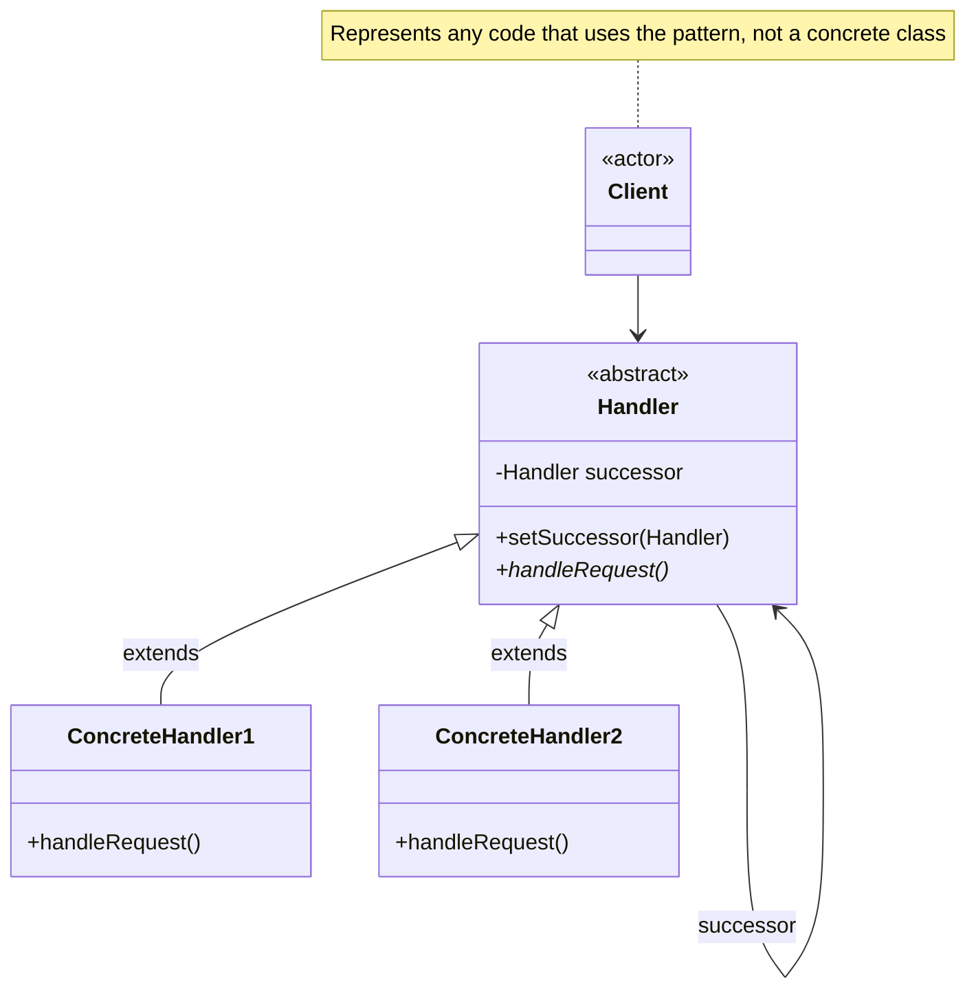

# Chain of Responsibility Pattern

Avoid coupling the sender of a request to its receiver by giving more than one object a chance to handle the request. Chain the receiving objects and pass the request along the chain until an object handles it.

## Problem

You need to decouple the sender of a request from its handler, and multiple objects may be able to handle the request. You don't want the sender to know which object will ultimately handle it.

**Common Scenarios:**

- Multi-level approval workflows (e.g. purchase approvals by amount)
- Logging frameworks routing messages by severity level
- Event bubbling in UI frameworks
- Middleware pipelines (HTTP request/response processing)
- Technical support escalation tiers

## Design Principles Applied

1. **Single Responsibility Principle** - Each handler handles only what it is responsible for
2. **Open/Closed Principle** - Add new handlers without modifying existing ones
3. **Loose Coupling** - Sender has no knowledge of which handler processes the request

## UML Diagram



## Implementation

### Example: Support Ticket Escalation

### Step 1: Define the Abstract Handler

```java
public abstract class SupportHandler {
    protected SupportHandler successor;

    public void setSuccessor(SupportHandler successor) {
        this.successor = successor;
    }

    public abstract void handleRequest(SupportTicket ticket);
}
```

### Step 2: Define the Request

```java
public class SupportTicket {
    public enum Priority { LOW, MEDIUM, HIGH, CRITICAL }

    private String description;
    private Priority priority;

    public SupportTicket(String description, Priority priority) {
        this.description = description;
        this.priority = priority;
    }

    public Priority getPriority() { return priority; }
    public String getDescription() { return description; }
}
```

### Step 3: Create Concrete Handlers

```java
public class FrontlineSupport extends SupportHandler {
    @Override
    public void handleRequest(SupportTicket ticket) {
        if (ticket.getPriority() == SupportTicket.Priority.LOW) {
            System.out.println("Frontline support handling: " + ticket.getDescription());
        } else if (successor != null) {
            successor.handleRequest(ticket);
        }
    }
}

public class TechnicalSupport extends SupportHandler {
    @Override
    public void handleRequest(SupportTicket ticket) {
        if (ticket.getPriority() == SupportTicket.Priority.MEDIUM) {
            System.out.println("Technical support handling: " + ticket.getDescription());
        } else if (successor != null) {
            successor.handleRequest(ticket);
        }
    }
}

public class ManagementSupport extends SupportHandler {
    @Override
    public void handleRequest(SupportTicket ticket) {
        if (ticket.getPriority() == SupportTicket.Priority.HIGH
                || ticket.getPriority() == SupportTicket.Priority.CRITICAL) {
            System.out.println("Management handling: " + ticket.getDescription());
        } else if (successor != null) {
            successor.handleRequest(ticket);
        }
    }
}
```

### Step 4: Assemble the Chain

```java
SupportHandler frontline = new FrontlineSupport();
SupportHandler technical = new TechnicalSupport();
SupportHandler management = new ManagementSupport();

frontline.setSuccessor(technical);
technical.setSuccessor(management);

// Client sends requests to the start of the chain
frontline.handleRequest(new SupportTicket("Password reset", SupportTicket.Priority.LOW));
// Frontline support handling: Password reset

frontline.handleRequest(new SupportTicket("Database corruption", SupportTicket.Priority.CRITICAL));
// Management handling: Database corruption
```

## Example 2: Logging by Severity

A logger that routes messages to the appropriate output based on log level — a classic GoF example.

```java
public abstract class Logger {
    public static final int INFO  = 1;
    public static final int DEBUG = 2;
    public static final int ERROR = 3;

    protected int level;
    protected Logger nextLogger;

    public Logger setNext(Logger nextLogger) {
        this.nextLogger = nextLogger;
        return nextLogger;
    }

    public void log(int level, String message) {
        if (this.level <= level) {
            write(message);
        }
        if (nextLogger != null) {
            nextLogger.log(level, message);
        }
    }

    protected abstract void write(String message);
}

public class ConsoleLogger extends Logger {
    public ConsoleLogger(int level) { this.level = level; }

    @Override
    protected void write(String message) {
        System.out.println("Console [INFO]: " + message);
    }
}

public class FileLogger extends Logger {
    public FileLogger(int level) { this.level = level; }

    @Override
    protected void write(String message) {
        System.out.println("File [DEBUG]: " + message);
    }
}

public class ErrorLogger extends Logger {
    public ErrorLogger(int level) { this.level = level; }

    @Override
    protected void write(String message) {
        System.err.println("Error [ERROR]: " + message);
    }
}

// Assemble the chain
Logger errorLogger = new ErrorLogger(Logger.ERROR);
Logger fileLogger  = new FileLogger(Logger.DEBUG);
Logger consoleLogger = new ConsoleLogger(Logger.INFO);

consoleLogger.setNext(fileLogger).setNext(errorLogger);

consoleLogger.log(Logger.INFO,  "System started");   // Console only
consoleLogger.log(Logger.DEBUG, "Debug info");        // Console + File
consoleLogger.log(Logger.ERROR, "Something failed");  // Console + File + Error
```

## Real-World Examples

- **Java Servlet Filters** — each filter in `FilterChain` processes the request then passes it on
- **Spring Security filter chain** — authentication, authorisation, and CSRF filters in sequence
- **`java.util.logging`** — log records passed up through parent loggers
- **DOM event bubbling** — events propagate from child to parent elements

## Chain of Responsibility vs Similar Patterns

| Pattern | Intent | Handler decides |
|---------|--------|-----------------|
| **Chain of Responsibility** | Pass request along a chain until handled | Whether to handle or forward |
| **Command** | Encapsulate a request as an object | How to execute a specific action |
| **Decorator** | Add behaviour by wrapping objects | Always delegates, never stops the chain |
| **Strategy** | Swap one algorithm for another | How to perform an action (no chaining) |
