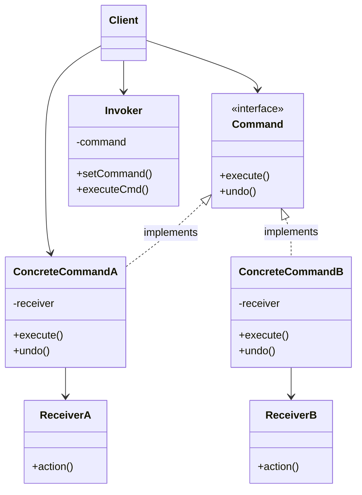

# Command Pattern

Encapsulate a request as an object, thereby letting you parameterize clients with different requests, queue or log requests, and support undoable operations.

## Problem

You need to decouple the object that invokes an operation from the object that knows how to perform it. You want to queue operations, schedule their execution, or execute them remotely.

**Common Scenarios:**
- Implementing undo/redo functionality
- Creating macro commands (sequence of commands)
- Logging and auditing operations
- Job queues and thread pools
- Remote procedure calls

## Design Principles Applied

1. **Encapsulate what varies** - The actions/requests vary
2. **Program to an interface, not implementation** - Use Command interface
3. **Single Responsibility Principle** - Commands are responsible for one action

## UML Diagram



## Implementation

### Step 1: Define the Command Interface

```java
// Command interface - declares execution method
public interface Command {
    void execute();
    void undo();
}
```

### Step 2: Create Receiver Classes

```java
// Receiver - Light that can be turned on/off
public class Light {
    private String location;
    private boolean isOn = false;

    public Light(String location) {
        this.location = location;
    }

    public void on() {
        isOn = true;
        System.out.println(location + " light is ON");
    }

    public void off() {
        isOn = false;
        System.out.println(location + " light is OFF");
    }

    public boolean isOn() {
        return isOn;
    }
}

// Receiver - Stereo system
public class Stereo {
    private String location;
    private boolean isOn = false;
    private int volume = 0;

    public Stereo(String location) {
        this.location = location;
    }

    public void on() {
        isOn = true;
        System.out.println(location + " stereo is ON");
    }

    public void off() {
        isOn = false;
        System.out.println(location + " stereo is OFF");
    }

    public void setVolume(int volume) {
        this.volume = volume;
        System.out.println(location + " stereo volume set to " + volume);
    }

    public int getVolume() {
        return volume;
    }
}
```

### Step 3: Create Concrete Command Classes

```java
// Concrete Command - Turn light on
public class LightOnCommand implements Command {
    private Light light;

    public LightOnCommand(Light light) {
        this.light = light;
    }

    @Override
    public void execute() {
        light.on();
    }

    @Override
    public void undo() {
        light.off();
    }
}

// Concrete Command - Turn light off
public class LightOffCommand implements Command {
    private Light light;

    public LightOffCommand(Light light) {
        this.light = light;
    }

    @Override
    public void execute() {
        light.off();
    }

    @Override
    public void undo() {
        light.on();
    }
}

// Concrete Command - Stereo on with CD
public class StereoOnWithCDCommand implements Command {
    private Stereo stereo;
    private int previousVolume;

    public StereoOnWithCDCommand(Stereo stereo) {
        this.stereo = stereo;
    }

    @Override
    public void execute() {
        previousVolume = stereo.getVolume();
        stereo.on();
        stereo.setVolume(11);
        System.out.println("Stereo is playing CD");
    }

    @Override
    public void undo() {
        stereo.setVolume(previousVolume);
        stereo.off();
    }
}

// No-op command (Null Object Pattern)
public class NoCommand implements Command {
    @Override
    public void execute() {
        // Do nothing
    }

    @Override
    public void undo() {
        // Do nothing
    }
}
```

### Step 4: Create Macro Command

```java
// Macro Command - Execute multiple commands
public class MacroCommand implements Command {
    private Command[] commands;

    public MacroCommand(Command[] commands) {
        this.commands = commands;
    }

    @Override
    public void execute() {
        for (Command command : commands) {
            command.execute();
        }
    }

    @Override
    public void undo() {
        // Undo in reverse order
        for (int i = commands.length - 1; i >= 0; i--) {
            commands[i].undo();
        }
    }
}
```

### Step 5: Create Invoker

```java
// Invoker - Remote Control
public class RemoteControl {
    private Command[] onCommands;
    private Command[] offCommands;
    private Command undoCommand;

    public RemoteControl() {
        onCommands = new Command[7];
        offCommands = new Command[7];

        Command noCommand = new NoCommand();
        for (int i = 0; i < 7; i++) {
            onCommands[i] = noCommand;
            offCommands[i] = noCommand;
        }
        undoCommand = noCommand;
    }

    public void setCommand(int slot, Command onCommand, Command offCommand) {
        onCommands[slot] = onCommand;
        offCommands[slot] = offCommand;
    }

    public void onButtonPressed(int slot) {
        onCommands[slot].execute();
        undoCommand = onCommands[slot];
    }

    public void offButtonPressed(int slot) {
        offCommands[slot].execute();
        undoCommand = offCommands[slot];
    }

    public void undoButtonPressed() {
        undoCommand.undo();
    }

    public String toString() {
        StringBuilder sb = new StringBuilder();
        sb.append("\n------ Remote Control ------\n");
        for (int i = 0; i < onCommands.length; i++) {
            sb.append("[slot " + i + "] ")
              .append(onCommands[i].getClass().getSimpleName())
              .append("    ")
              .append(offCommands[i].getClass().getSimpleName())
              .append("\n");
        }
        sb.append("[undo] ").append(undoCommand.getClass().getSimpleName()).append("\n");
        return sb.toString();
    }
}
```

### Step 6: Client Code

```java
public class HomeAutomationTest {
    public static void main(String[] args) {
        // Create receivers
        Light livingRoomLight = new Light("Living Room");
        Light kitchenLight = new Light("Kitchen");
        Stereo livingRoomStereo = new Stereo("Living Room");

        // Create commands
        LightOnCommand livingRoomLightOn = new LightOnCommand(livingRoomLight);
        LightOffCommand livingRoomLightOff = new LightOffCommand(livingRoomLight);

        LightOnCommand kitchenLightOn = new LightOnCommand(kitchenLight);
        LightOffCommand kitchenLightOff = new LightOffCommand(kitchenLight);

        StereoOnWithCDCommand stereoOn = new StereoOnWithCDCommand(livingRoomStereo);

        // Create remote control (invoker)
        RemoteControl remote = new RemoteControl();

        // Program remote control
        remote.setCommand(0, livingRoomLightOn, livingRoomLightOff);
        remote.setCommand(1, kitchenLightOn, kitchenLightOff);
        remote.setCommand(2, stereoOn, new NoCommand());

        System.out.println(remote);

        // Test buttons
        remote.onButtonPressed(0);  // Living room light on
        remote.offButtonPressed(0); // Living room light off
        remote.undoButtonPressed(); // Undo - light on again

        remote.onButtonPressed(1);  // Kitchen light on
        remote.onButtonPressed(2);  // Stereo on

        // Macro command - Party mode
        Command[] partyOn = {
            livingRoomLightOn,
            kitchenLightOn,
            stereoOn
        };
        Command[] partyOff = {
            livingRoomLightOff,
            kitchenLightOff
        };

        MacroCommand partyOnMacro = new MacroCommand(partyOn);
        MacroCommand partyOffMacro = new MacroCommand(partyOff);

        remote.setCommand(3, partyOnMacro, partyOffMacro);

        System.out.println("\n--- Pushing Party Mode! ---");
        remote.onButtonPressed(3);

        System.out.println("\n--- Undo Party Mode! ---");
        remote.undoButtonPressed();
    }
}
```

**Output:**
```
------ Remote Control ------
[slot 0] LightOnCommand    LightOffCommand
[slot 1] LightOnCommand    LightOffCommand
[slot 2] StereoOnWithCDCommand    NoCommand
[slot 3] MacroCommand    MacroCommand
[slot 4] NoCommand    NoCommand
[slot 5] NoCommand    NoCommand
[slot 6] NoCommand    NoCommand
[undo] NoCommand

Living Room light is ON
Living Room light is OFF
Living Room light is ON
Kitchen light is ON
Living Room stereo is ON
Living Room stereo volume set to 11
Stereo is playing CD

--- Pushing Party Mode! ---
Living Room light is ON
Kitchen light is ON
Living Room stereo is ON
Living Room stereo volume set to 11
Stereo is playing CD

--- Undo Party Mode! ---
Living Room stereo volume set to 0
Living Room stereo is OFF
Kitchen light is OFF
Living Room light is OFF
```

## Real-World Examples

### Java API
- **Runnable interface** - Commands for thread execution
- **ActionListener** - Commands for GUI events
- **java.lang.Runnable** - Execute command pattern
- **javax.swing.Action** - GUI action commands

### Use Cases
- **Text Editors** - Undo/redo operations
- **Transactional Systems** - Rollback operations
- **Job Schedulers** - Queue and execute jobs
- **Wizards** - Navigate between steps
- **Menu Systems** - Menu item actions

## Advantages

1. **Decoupling** - Separates object that invokes operation from object that performs it
2. **Extensibility** - Easy to add new commands without changing existing code
3. **Undo/Redo** - Built-in support for reversible operations
4. **Macro Commands** - Combine multiple commands into one
5. **Queueing** - Commands can be queued and executed later
6. **Logging** - Commands can be logged for audit trails

## Disadvantages

1. **Complexity** - Increases number of classes in the system
2. **Overhead** - May be overkill for simple operations
3. **Memory** - Storing command history uses memory

## When to Use

✅ **Use Command Pattern When:**
- You need to parameterize objects with operations
- You need to queue operations for later execution
- You need to support undo/redo
- You need to log changes for auditing
- You need to structure system around high-level operations

❌ **Don't Use Command Pattern When:**
- Operations are simple and don't need queuing/undo
- You don't need to decouple invoker from receiver
- Overhead of extra classes isn't justified

## Related Patterns

- **Composite** - Macro commands use Composite pattern
- **Memento** - Can be used to implement undo by storing state
- **Strategy** - Commands encapsulate algorithms like strategies
- **Chain of Responsibility** - Commands can be chained

## Key Takeaways

1. Encapsulate requests as objects
2. Decouple sender from receiver
3. Support undo/redo operations
4. Enable macro commands
5. Allow queuing and logging of operations
6. Commands are first-class objects that can be passed around

---

**The Command Pattern turns requests into stand-alone objects that contain all information about the request!**
