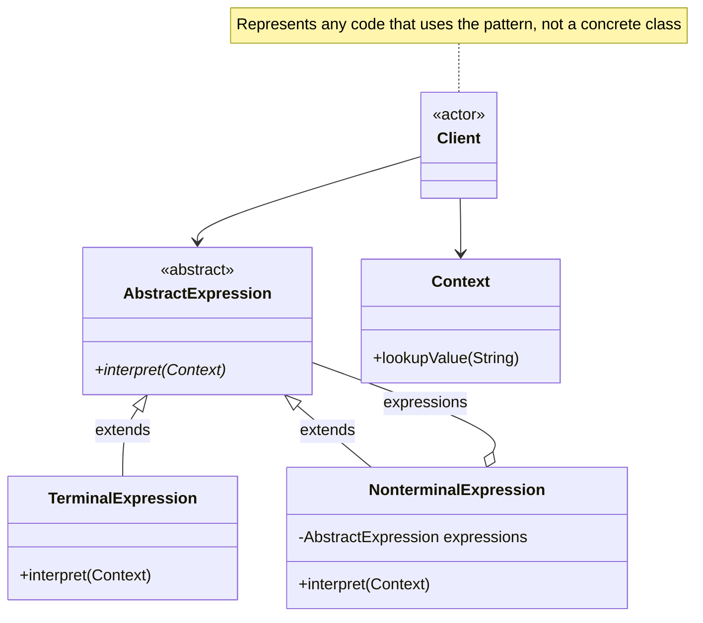

# Interpreter Pattern

Given a language, define a representation for its grammar along with an interpreter that uses the representation to interpret sentences in the language.

:::note Class Pattern
Interpreter is one of the four **class-scope patterns** in GoF. It relies on inheritance — each grammar rule maps to a subclass of `AbstractExpression`. See [Class and Object Patterns](/docs/design-patterns/class-and-object-patterns) for details.
:::

## Problem

You have a simple language or notation that needs to be parsed and evaluated repeatedly. You want to represent each grammar rule as a class so that the grammar can be extended easily.

**Common Scenarios:**

- Evaluating arithmetic or boolean expressions
- Implementing scripting or rule engines
- Parsing regular expressions or SQL-like query syntax
- Configuration file interpreters
- Compiler front-ends for domain-specific languages (DSLs)

## Design Principles Applied

1. **Open/Closed Principle** - Add new grammar rules by adding new subclasses
2. **Single Responsibility** - Each class represents exactly one grammar rule
3. **Composite structure** - Non-terminal expressions are composed of other expressions

## UML Diagram



## Implementation

### Example 1: Arithmetic Expression Evaluator

Evaluates expressions like `5 + 3 - 2`.

### Step 1: Define the Context

```java
// Context holds variable values for the interpreter to look up
public class Context {
    private final Map<String, Integer> variables = new HashMap<>();

    public void assign(String variable, int value) {
        variables.put(variable, value);
    }

    public int lookup(String variable) {
        return variables.getOrDefault(variable, 0);
    }
}
```

### Step 2: Define the Abstract Expression

```java
public abstract class Expression {
    public abstract int interpret(Context context);
}
```

### Step 3: Create Terminal Expressions

```java
// Terminal: a literal number
public class NumberExpression extends Expression {
    private final int number;

    public NumberExpression(int number) {
        this.number = number;
    }

    @Override
    public int interpret(Context context) {
        return number;
    }
}

// Terminal: a variable name looked up in context
public class VariableExpression extends Expression {
    private final String name;

    public VariableExpression(String name) {
        this.name = name;
    }

    @Override
    public int interpret(Context context) {
        return context.lookup(name);
    }
}
```

### Step 4: Create Non-Terminal Expressions

```java
// Non-terminal: addition of two expressions
public class AddExpression extends Expression {
    private final Expression left;
    private final Expression right;

    public AddExpression(Expression left, Expression right) {
        this.left = left;
        this.right = right;
    }

    @Override
    public int interpret(Context context) {
        return left.interpret(context) + right.interpret(context);
    }
}

// Non-terminal: subtraction of two expressions
public class SubtractExpression extends Expression {
    private final Expression left;
    private final Expression right;

    public SubtractExpression(Expression left, Expression right) {
        this.left = left;
        this.right = right;
    }

    @Override
    public int interpret(Context context) {
        return left.interpret(context) - right.interpret(context);
    }
}
```

### Step 5: Build and Evaluate an Abstract Syntax Tree

```java
Context context = new Context();
context.assign("x", 10);
context.assign("y", 4);

// Represents: (x + 5) - y
Expression expression = new SubtractExpression(
    new AddExpression(
        new VariableExpression("x"),
        new NumberExpression(5)
    ),
    new VariableExpression("y")
);

System.out.println(expression.interpret(context)); // (10 + 5) - 4 = 11
```

## Example 2: Boolean Expression Evaluator

A rule engine evaluating conditions like `isActive AND (hasPermission OR isAdmin)`.

```java
public abstract class BooleanExpression {
    public abstract boolean interpret(Map<String, Boolean> context);
}

// Terminal: a named flag
public class VariableExp extends BooleanExpression {
    private final String name;

    public VariableExp(String name) { this.name = name; }

    @Override
    public boolean interpret(Map<String, Boolean> context) {
        return context.getOrDefault(name, false);
    }
}

// Non-terminal: logical AND
public class AndExpression extends BooleanExpression {
    private final BooleanExpression left;
    private final BooleanExpression right;

    public AndExpression(BooleanExpression left, BooleanExpression right) {
        this.left = left;
        this.right = right;
    }

    @Override
    public boolean interpret(Map<String, Boolean> context) {
        return left.interpret(context) && right.interpret(context);
    }
}

// Non-terminal: logical OR
public class OrExpression extends BooleanExpression {
    private final BooleanExpression left;
    private final BooleanExpression right;

    public OrExpression(BooleanExpression left, BooleanExpression right) {
        this.left = left;
        this.right = right;
    }

    @Override
    public boolean interpret(Map<String, Boolean> context) {
        return left.interpret(context) || right.interpret(context);
    }
}

// Usage: isActive AND (hasPermission OR isAdmin)
BooleanExpression rule = new AndExpression(
    new VariableExp("isActive"),
    new OrExpression(
        new VariableExp("hasPermission"),
        new VariableExp("isAdmin")
    )
);

Map<String, Boolean> user = Map.of(
    "isActive", true,
    "hasPermission", false,
    "isAdmin", true
);

System.out.println(rule.interpret(user)); // true
```

## Real-World Examples

- **`java.util.regex.Pattern`** — compiles a regular expression grammar into an interpreter
- **Spring Expression Language (SpEL)** — evaluates expressions like `#{user.age > 18}`
- **SQL parsers** — each clause (WHERE, SELECT, JOIN) maps to an expression node
- **Thymeleaf / JEXL** — template expression evaluators

## When Not to Use Interpreter

The pattern works well for simple grammars. Avoid it when:

- The grammar has many rules — the class count grows quickly and becomes difficult to maintain
- Performance is critical — building and traversing a syntax tree has overhead
- A general-purpose parser library (ANTLR, JavaCC) would be simpler to use

## Interpreter vs Similar Patterns

| Pattern | Intent |
|---------|--------|
| **Interpreter** | Evaluates sentences in a grammar using a class-per-rule hierarchy |
| **Composite** | Same tree structure, but for part-whole object hierarchies rather than grammars |
| **Visitor** | Separates operations from the expression tree — can add new operations without changing expression classes |
| **Strategy** | Swaps one algorithm; Interpreter defines a language of composable operations |
