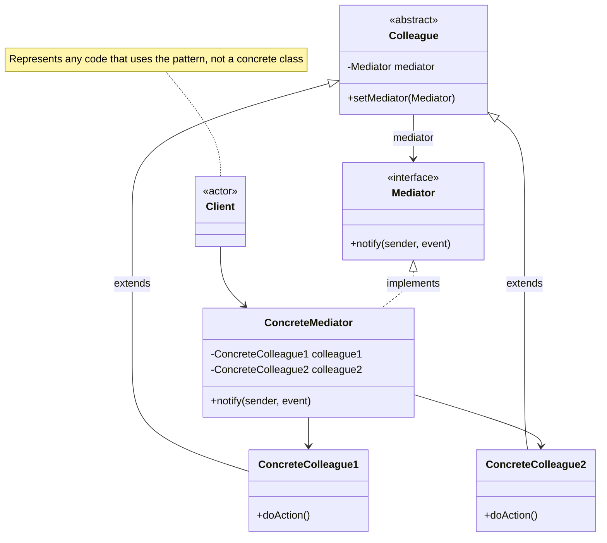

# Mediator Pattern

Define an object that encapsulates how a set of objects interact. Mediator promotes loose coupling by keeping objects from referring to each other explicitly, and it lets you vary their interaction independently.

## Problem

You have a set of objects that communicate directly with each other, creating a tightly coupled web of dependencies. Any change to one object requires understanding and updating all the others it talks to.

**Common Scenarios:**

- Chat rooms where users send messages through a central hub
- Air traffic control systems coordinating aircraft
- UI forms where enabling one component affects others
- Event bus or message broker systems
- Smart home hubs coordinating devices

## Design Principles Applied

1. **Principle of Least Knowledge** - Colleagues only know the mediator, not each other
2. **Single Responsibility** - Interaction logic is centralised in the mediator
3. **Open/Closed Principle** - Add new colleagues without changing existing ones

## UML Diagram



## Implementation

### Example 1: Chat Room

Users send messages through a central chat room rather than directly to each other.

### Step 1: Define the Mediator Interface

```java
public interface ChatMediator {
    void sendMessage(String message, User sender);
    void addUser(User user);
}
```

### Step 2: Define the Colleague

```java
public abstract class User {
    protected ChatMediator mediator;
    protected String name;

    public User(ChatMediator mediator, String name) {
        this.mediator = mediator;
        this.name = name;
    }

    public abstract void send(String message);
    public abstract void receive(String message);
}
```

### Step 3: Create the Concrete Mediator

```java
public class ChatRoom implements ChatMediator {
    private final List<User> users = new ArrayList<>();

    @Override
    public void addUser(User user) {
        users.add(user);
    }

    @Override
    public void sendMessage(String message, User sender) {
        for (User user : users) {
            // Don't send the message back to the sender
            if (user != sender) {
                user.receive("[" + sender.name + "]: " + message);
            }
        }
    }
}
```

### Step 4: Create Concrete Colleagues

```java
public class ChatUser extends User {
    public ChatUser(ChatMediator mediator, String name) {
        super(mediator, name);
    }

    @Override
    public void send(String message) {
        System.out.println(name + " sends: " + message);
        mediator.sendMessage(message, this);
    }

    @Override
    public void receive(String message) {
        System.out.println(name + " receives: " + message);
    }
}
```

### Step 5: Client Usage

```java
ChatRoom chatRoom = new ChatRoom();

ChatUser alice = new ChatUser(chatRoom, "Alice");
ChatUser bob   = new ChatUser(chatRoom, "Bob");
ChatUser carol = new ChatUser(chatRoom, "Carol");

chatRoom.addUser(alice);
chatRoom.addUser(bob);
chatRoom.addUser(carol);

alice.send("Hello everyone!");
// Alice sends: Hello everyone!
// Bob receives: [Alice]: Hello everyone!
// Carol receives: [Alice]: Hello everyone!

bob.send("Hey Alice!");
// Bob sends: Hey Alice!
// Alice receives: [Bob]: Hey Alice!
// Carol receives: [Bob]: Hey Alice!
```

## Example 2: UI Form Mediator

A dialog box where components affect each other — checking a checkbox enables a text field and a button.

```java
public interface DialogMediator {
    void componentChanged(Component component);
}

public abstract class Component {
    protected DialogMediator mediator;

    public Component(DialogMediator mediator) {
        this.mediator = mediator;
    }
}

public class Checkbox extends Component {
    private boolean checked;

    public Checkbox(DialogMediator mediator) { super(mediator); }

    public boolean isChecked() { return checked; }

    public void setChecked(boolean checked) {
        this.checked = checked;
        mediator.componentChanged(this);
    }
}

public class TextField extends Component {
    private boolean enabled;

    public TextField(DialogMediator mediator) { super(mediator); }

    public void setEnabled(boolean enabled) {
        this.enabled = enabled;
        System.out.println("TextField is now " + (enabled ? "enabled" : "disabled"));
    }
}

public class SubmitButton extends Component {
    private boolean enabled;

    public SubmitButton(DialogMediator mediator) { super(mediator); }

    public void setEnabled(boolean enabled) {
        this.enabled = enabled;
        System.out.println("Submit button is now " + (enabled ? "enabled" : "disabled"));
    }
}

public class RegistrationDialog implements DialogMediator {
    private final Checkbox agreeCheckbox;
    private final TextField nameField;
    private final SubmitButton submitButton;

    public RegistrationDialog() {
        agreeCheckbox = new Checkbox(this);
        nameField     = new TextField(this);
        submitButton  = new SubmitButton(this);
    }

    @Override
    public void componentChanged(Component component) {
        if (component == agreeCheckbox) {
            boolean agreed = agreeCheckbox.isChecked();
            nameField.setEnabled(agreed);
            submitButton.setEnabled(agreed);
        }
    }
}

// Usage
RegistrationDialog dialog = new RegistrationDialog();
dialog.agreeCheckbox.setChecked(true);
// TextField is now enabled
// Submit button is now enabled
```

## Real-World Examples

- **Java Message Service (JMS)** — message broker acts as mediator between producers and consumers
- **Spring `ApplicationEventPublisher`** — components publish events; the publisher routes them to listeners
- **Redux store (JavaScript)** — central store mediates state changes between UI components
- **Air Traffic Control** — all aircraft communicate through the tower, not with each other directly

## Mediator vs Similar Patterns

| Pattern | Intent | Coupling |
|---------|--------|---------|
| **Mediator** | Centralise complex interactions between many objects | Colleagues are decoupled from each other, coupled to mediator |
| **Observer** | Notify dependents of state changes | Subject decoupled from observers via interface |
| **Facade** | Simplify a complex subsystem | One-way — client talks to facade, not vice versa |
| **Command** | Encapsulate a request as an object | Decouples invoker from receiver, no coordination hub |
