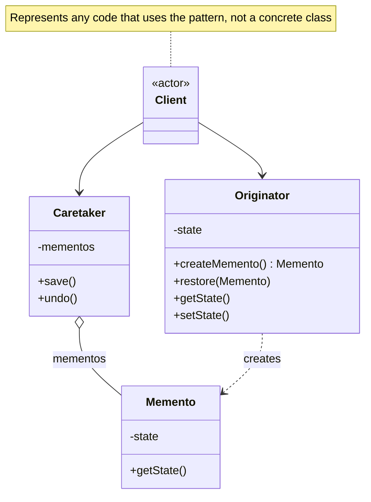

# Memento Pattern

Without violating encapsulation, capture and externalise an object's internal state so that the object can be restored to this state later.

## Problem

You need to implement undo/redo or snapshot functionality, but saving state directly exposes the internal details of an object, breaking encapsulation.

**Common Scenarios:**

- Undo/redo in text editors or drawing applications
- Game save states and checkpoints
- Transaction rollback in databases
- Wizard-style forms where users can go back
- Version history for documents or configurations

## Design Principles Applied

1. **Encapsulation** - The Originator's internal state is never exposed to the Caretaker
2. **Single Responsibility** - State saving is separated from the object that owns the state
3. **Open/Closed Principle** - Add new state snapshots without modifying the Originator

## Key Roles

| Role | Responsibility |
|------|---------------|
| **Originator** | The object whose state is saved. Creates and restores mementos |
| **Memento** | Stores a snapshot of the Originator's state. Opaque to the Caretaker |
| **Caretaker** | Holds mementos and decides when to save/restore. Never reads memento contents |

## UML Diagram



## Implementation

### Example 1: Text Editor with Undo

### Step 1: Define the Memento

```java
// Memento — stores a snapshot of the editor's text
// Only the Originator (Editor) can read its state
public class EditorMemento {
    private final String text;
    private final int cursorPosition;

    public EditorMemento(String text, int cursorPosition) {
        this.text = text;
        this.cursorPosition = cursorPosition;
    }

    // Package-private so only classes in the same package (the Editor) can access state
    String getText() { return text; }
    int getCursorPosition() { return cursorPosition; }
}
```

### Step 2: Define the Originator

```java
// Originator — the text editor whose state we want to snapshot
public class TextEditor {
    private String text = "";
    private int cursorPosition = 0;

    public void type(String words) {
        text += words;
        cursorPosition = text.length();
    }

    public void delete(int characters) {
        if (characters > text.length()) characters = text.length();
        text = text.substring(0, text.length() - characters);
        cursorPosition = text.length();
    }

    // Creates a snapshot of current state
    public EditorMemento save() {
        return new EditorMemento(text, cursorPosition);
    }

    // Restores state from a snapshot
    public void restore(EditorMemento memento) {
        this.text = memento.getText();
        this.cursorPosition = memento.getCursorPosition();
    }

    public String getText() { return text; }
}
```

### Step 3: Define the Caretaker

```java
// Caretaker — manages the history of snapshots
// It stores and retrieves mementos but never inspects their contents
public class EditorHistory {
    private final Deque<EditorMemento> history = new ArrayDeque<>();

    public void save(TextEditor editor) {
        history.push(editor.save());
    }

    public void undo(TextEditor editor) {
        if (!history.isEmpty()) {
            editor.restore(history.pop());
        }
    }

    public int size() { return history.size(); }
}
```

### Step 4: Client Usage

```java
TextEditor editor = new TextEditor();
EditorHistory history = new EditorHistory();

editor.type("Hello");
history.save(editor);      // snapshot 1: "Hello"

editor.type(", World");
history.save(editor);      // snapshot 2: "Hello, World"

editor.type("!!!");
System.out.println(editor.getText()); // Hello, World!!!

history.undo(editor);
System.out.println(editor.getText()); // Hello, World

history.undo(editor);
System.out.println(editor.getText()); // Hello
```

## Example 2: Game Checkpoint

```java
public class GameState {
    private final int level;
    private final int health;
    private final int score;

    public GameState(int level, int health, int score) {
        this.level = level;
        this.health = health;
        this.score = score;
    }

    int getLevel()  { return level; }
    int getHealth() { return health; }
    int getScore()  { return score; }
}

public class Game {
    private int level  = 1;
    private int health = 100;
    private int score  = 0;

    public void progress(int levelsGained, int healthLost, int pointsScored) {
        level  += levelsGained;
        health -= healthLost;
        score  += pointsScored;
    }

    public GameState save() {
        return new GameState(level, health, score);
    }

    public void restore(GameState state) {
        this.level  = state.getLevel();
        this.health = state.getHealth();
        this.score  = state.getScore();
    }

    @Override
    public String toString() {
        return "Level=" + level + ", Health=" + health + ", Score=" + score;
    }
}

// Usage
Game game = new Game();
game.progress(2, 20, 300);
System.out.println(game); // Level=3, Health=80, Score=300

GameState checkpoint = game.save();

game.progress(1, 90, 100); // bad run, nearly died
System.out.println(game);  // Level=4, Health=-10, Score=400

game.restore(checkpoint);
System.out.println(game);  // Level=3, Health=80, Score=300
```

## Real-World Examples

- **`javax.swing.undo.UndoManager`** — Java Swing's built-in undo framework uses the Memento concept
- **Git commits** — each commit is a snapshot (memento) of the repository state
- **Database transactions** — a savepoint captures state that can be rolled back to
- **Serialization** — serialising an object to bytes/JSON is a form of memento

## Memento vs Similar Patterns

| Pattern | Intent |
|---------|--------|
| **Memento** | Snapshot and restore an object's private state without breaking encapsulation |
| **Command** | Supports undo by storing the inverse operation, not a full state snapshot |
| **Prototype** | Clones an object's state, but the clone is a fully usable copy, not an opaque token |
| **State** | Changes an object's behaviour based on its current state; doesn't capture history |
