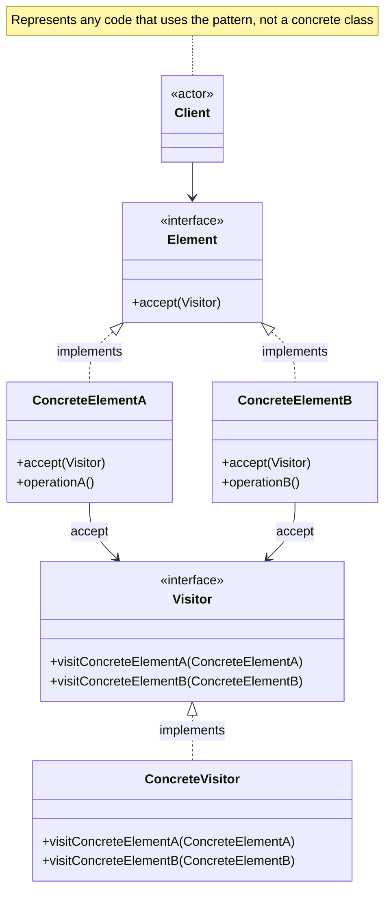

# Visitor Pattern

Represent an operation to be performed on elements of an object structure. Visitor lets you define a new operation without changing the classes of the elements on which it operates.

## Problem

You have a stable object structure (e.g. a tree of nodes) and you need to perform many distinct, unrelated operations on it. Adding each operation directly to the element classes pollutes them with unrelated concerns and requires modifying every class each time a new operation is needed.

**Common Scenarios:**

- Running multiple analysis passes over an AST (abstract syntax tree)
- Calculating different metrics over a file system hierarchy
- Exporting a document model to different formats (HTML, PDF, plain text)
- Applying tax or discount rules to items in a shopping cart
- Code generation, linting, and type-checking over the same node tree

## Design Principles Applied

1. **Open/Closed Principle** - Add new operations by adding new Visitor classes, not modifying elements
2. **Single Responsibility** - Each visitor encapsulates one operation across all element types
3. **Separation of Concerns** - Algorithm logic is separated from the object structure it operates on

## Double Dispatch

The key mechanism in Visitor is **double dispatch** — the operation that runs depends on both the type of the Visitor *and* the type of the Element:

1. Client calls `element.accept(visitor)` — dispatch on element type
2. Element calls `visitor.visit(this)` — dispatch on visitor type

This ensures the correct `visit` overload is called without requiring `instanceof` checks.

## UML Diagram



## Implementation

### Example 1: Shopping Cart with Tax and Discount Visitors

Two separate operations (tax calculation and discount reporting) over the same cart items.

### Step 1: Define the Element Interface

```java
public interface CartItem {
    String getName();
    double getPrice();
    void accept(CartVisitor visitor);
}
```

### Step 2: Define the Visitor Interface

```java
public interface CartVisitor {
    void visit(Book book);
    void visit(Electronics electronics);
    void visit(Clothing clothing);
}
```

### Step 3: Create Concrete Elements

```java
public class Book implements CartItem {
    private String name;
    private double price;
    private boolean isEducational;

    public Book(String name, double price, boolean isEducational) {
        this.name = name;
        this.price = price;
        this.isEducational = isEducational;
    }

    public boolean isEducational() { return isEducational; }

    @Override
    public String getName() { return name; }

    @Override
    public double getPrice() { return price; }

    @Override
    public void accept(CartVisitor visitor) {
        visitor.visit(this); // double dispatch — calls visit(Book)
    }
}

public class Electronics implements CartItem {
    private String name;
    private double price;

    public Electronics(String name, double price) {
        this.name = name;
        this.price = price;
    }

    @Override
    public String getName() { return name; }

    @Override
    public double getPrice() { return price; }

    @Override
    public void accept(CartVisitor visitor) {
        visitor.visit(this); // double dispatch — calls visit(Electronics)
    }
}

public class Clothing implements CartItem {
    private String name;
    private double price;

    public Clothing(String name, double price) {
        this.name = name;
        this.price = price;
    }

    @Override
    public String getName() { return name; }

    @Override
    public double getPrice() { return price; }

    @Override
    public void accept(CartVisitor visitor) {
        visitor.visit(this); // double dispatch — calls visit(Clothing)
    }
}
```

### Step 4: Create Concrete Visitors

```java
// Visitor 1: Calculate total tax
public class TaxVisitor implements CartVisitor {
    private double totalTax = 0;

    @Override
    public void visit(Book book) {
        // Educational books are tax-exempt
        double tax = book.isEducational() ? 0 : book.getPrice() * 0.05;
        totalTax += tax;
        System.out.printf("Tax on %s: %.2f%n", book.getName(), tax);
    }

    @Override
    public void visit(Electronics electronics) {
        double tax = electronics.getPrice() * 0.18;
        totalTax += tax;
        System.out.printf("Tax on %s: %.2f%n", electronics.getName(), tax);
    }

    @Override
    public void visit(Clothing clothing) {
        double tax = clothing.getPrice() * 0.12;
        totalTax += tax;
        System.out.printf("Tax on %s: %.2f%n", clothing.getName(), tax);
    }

    public double getTotalTax() { return totalTax; }
}

// Visitor 2: Apply discounts
public class DiscountVisitor implements CartVisitor {
    private double totalDiscount = 0;

    @Override
    public void visit(Book book) {
        double discount = book.getPrice() * 0.10; // 10% off books
        totalDiscount += discount;
        System.out.printf("Discount on %s: %.2f%n", book.getName(), discount);
    }

    @Override
    public void visit(Electronics electronics) {
        double discount = electronics.getPrice() * 0.05; // 5% off electronics
        totalDiscount += discount;
        System.out.printf("Discount on %s: %.2f%n", electronics.getName(), discount);
    }

    @Override
    public void visit(Clothing clothing) {
        double discount = clothing.getPrice() * 0.20; // 20% off clothing
        totalDiscount += discount;
        System.out.printf("Discount on %s: %.2f%n", clothing.getName(), discount);
    }

    public double getTotalDiscount() { return totalDiscount; }
}
```

### Step 5: Client Usage

```java
List<CartItem> cart = List.of(
    new Book("Clean Code", 35.00, false),
    new Book("Java Textbook", 60.00, true),
    new Electronics("Headphones", 120.00),
    new Clothing("T-Shirt", 25.00)
);

TaxVisitor taxVisitor = new TaxVisitor();
cart.forEach(item -> item.accept(taxVisitor));
System.out.printf("Total tax: %.2f%n%n", taxVisitor.getTotalTax());

DiscountVisitor discountVisitor = new DiscountVisitor();
cart.forEach(item -> item.accept(discountVisitor));
System.out.printf("Total discount: %.2f%n", discountVisitor.getTotalDiscount());
```

## When to Use vs Avoid

**Use Visitor when:**

- The object structure is stable but you frequently add new operations
- You need many distinct, unrelated operations over the same structure

**Avoid Visitor when:**

- New element types are added frequently — every new element requires updating all visitors
- The object structure is simple — the pattern adds significant boilerplate for little gain

## Real-World Examples

- **Java compiler (`javax.lang.model`)** — `ElementVisitor` visits annotation processing elements
- **ASM bytecode library** — `ClassVisitor`, `MethodVisitor`, `FieldVisitor` traverse JVM bytecode
- **Apache POI** — visitor-style traversal of Excel/Word document elements
- **ANTLR-generated parsers** — generated visitor classes walk parse tree nodes

## Visitor vs Similar Patterns

| Pattern | Adding new operations | Adding new element types |
|---------|----------------------|--------------------------|
| **Visitor** | Easy — add a new Visitor class | Hard — update every Visitor |
| **Strategy** | N/A — one algorithm, swappable | N/A — no element hierarchy |
| **Iterator** | Separates traversal, not operations | N/A |
| **Composite** | Defines structure, not operations | Easy — add a new leaf/composite |
| **Interpreter** | Same tree structure, grammar-focused | Hard — update all interpreters |
