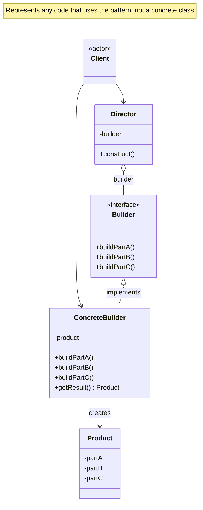

# Builder Pattern

Separate the construction of a complex object from its representation so that the same construction process can create different representations.

## Problem

You need to construct complex objects step by step. The construction process must allow different representations of the object being built, and you want to isolate the construction logic from the final product.

**Common Scenarios:**

- Building complex documents (HTML, PDF, plain text)
- Constructing SQL queries programmatically
- Creating complex UI forms with many optional fields
- Assembling meal orders or product configurations
- Generating test data objects with many fields

## Design Principles Applied

1. **Single Responsibility Principle** - Construction logic is isolated in the builder
2. **Open/Closed Principle** - Add new builders without changing the Director
3. **Separation of Concerns** - Director knows the steps; Builder knows how to execute them

## UML Diagram



## Implementation

### Example: Meal Builder

### Step 1: Define the Product

```java
public class Meal {
    private String mainCourse;
    private String side;
    private String drink;
    private String dessert;

    public void setMainCourse(String mainCourse) { this.mainCourse = mainCourse; }
    public void setSide(String side) { this.side = side; }
    public void setDrink(String drink) { this.drink = drink; }
    public void setDessert(String dessert) { this.dessert = dessert; }

    @Override
    public String toString() {
        return "Meal [main=" + mainCourse + ", side=" + side
            + ", drink=" + drink + ", dessert=" + dessert + "]";
    }
}
```

### Step 2: Define the Builder Interface

```java
public interface MealBuilder {
    void buildMainCourse();
    void buildSide();
    void buildDrink();
    void buildDessert();
    Meal getResult();
}
```

### Step 3: Create Concrete Builders

```java
public class VeganMealBuilder implements MealBuilder {
    private Meal meal = new Meal();

    @Override
    public void buildMainCourse() { meal.setMainCourse("Lentil curry"); }

    @Override
    public void buildSide() { meal.setSide("Steamed rice"); }

    @Override
    public void buildDrink() { meal.setDrink("Sparkling water"); }

    @Override
    public void buildDessert() { meal.setDessert("Fruit salad"); }

    @Override
    public Meal getResult() { return meal; }
}

public class KidsMealBuilder implements MealBuilder {
    private Meal meal = new Meal();

    @Override
    public void buildMainCourse() { meal.setMainCourse("Chicken nuggets"); }

    @Override
    public void buildSide() { meal.setSide("French fries"); }

    @Override
    public void buildDrink() { meal.setDrink("Apple juice"); }

    @Override
    public void buildDessert() { meal.setDessert("Ice cream"); }

    @Override
    public Meal getResult() { return meal; }
}
```

### Step 4: Create the Director

```java
public class MealDirector {
    private MealBuilder builder;

    public MealDirector(MealBuilder builder) {
        this.builder = builder;
    }

    public Meal construct() {
        builder.buildMainCourse();
        builder.buildSide();
        builder.buildDrink();
        builder.buildDessert();
        return builder.getResult();
    }
}
```

### Step 5: Client Usage

```java
MealDirector director = new MealDirector(new VeganMealBuilder());
Meal veganMeal = director.construct();
System.out.println(veganMeal);
// Meal [main=Lentil curry, side=Steamed rice, drink=Sparkling water, dessert=Fruit salad]

director = new MealDirector(new KidsMealBuilder());
Meal kidsMeal = director.construct();
System.out.println(kidsMeal);
// Meal [main=Chicken nuggets, side=French fries, drink=Apple juice, dessert=Ice cream]
```

## Example 2: Fluent Builder (Common Java Variant)

The fluent builder variant skips the Director — the client chains method calls directly. This is common in Java libraries (e.g. `StringBuilder`, `Stream.Builder`).

```java
public class HttpRequest {
    private final String url;
    private final String method;
    private final Map<String, String> headers;
    private final String body;

    private HttpRequest(Builder builder) {
        this.url = builder.url;
        this.method = builder.method;
        this.headers = builder.headers;
        this.body = builder.body;
    }

    public static class Builder {
        private String url;
        private String method = "GET";
        private Map<String, String> headers = new HashMap<>();
        private String body;

        public Builder url(String url) {
            this.url = url;
            return this;
        }

        public Builder method(String method) {
            this.method = method;
            return this;
        }

        public Builder header(String key, String value) {
            this.headers.put(key, value);
            return this;
        }

        public Builder body(String body) {
            this.body = body;
            return this;
        }

        public HttpRequest build() {
            if (url == null) throw new IllegalStateException("URL is required");
            return new HttpRequest(this);
        }
    }
}

// Usage
HttpRequest request = new HttpRequest.Builder()
    .url("https://api.example.com/users")
    .method("POST")
    .header("Content-Type", "application/json")
    .header("Authorization", "Bearer token123")
    .body("{\"name\": \"Alice\"}")
    .build();
```

## Real-World Examples

- **`StringBuilder`** — Java's built-in fluent builder for constructing strings
- **`Lombok @Builder`** — annotation that auto-generates a fluent builder for any class
- **`AlertDialog.Builder`** — Android SDK builder for constructing dialog boxes
- **`ProcessBuilder`** — Java's builder for constructing OS process commands

## Builder vs Other Patterns

| Pattern | Intent | Returns |
|---------|--------|---------|
| **Builder** | Constructs complex objects step by step | Fully assembled product |
| **Factory Method** | Delegates instantiation to subclasses | Single object in one step |
| **Abstract Factory** | Creates families of related objects | Multiple related objects |
| **Prototype** | Copies an existing object | Clone of existing instance |
