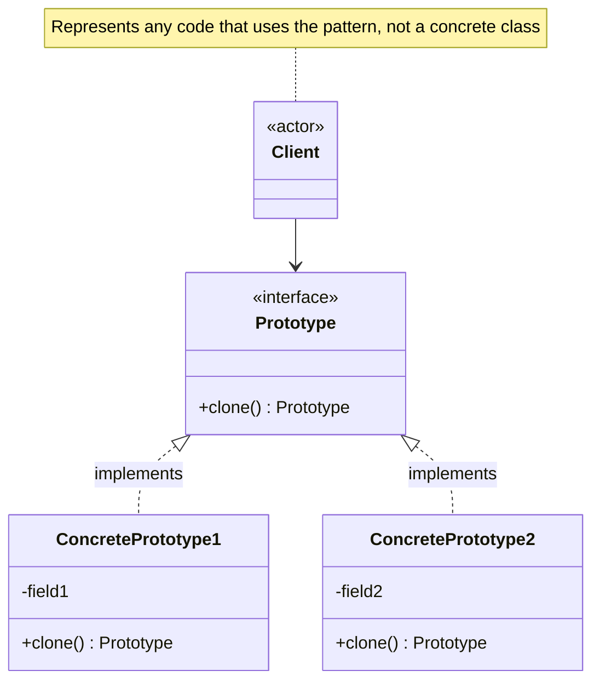

# Prototype Pattern

Specify the kinds of objects to create using a prototypical instance, and create new objects by copying this prototype.

## Problem

You need to create new objects that are copies of existing ones, but the class to instantiate is unknown at compile time, or creating an object from scratch is expensive compared to copying an existing one.

**Common Scenarios:**

- Copying complex objects that are expensive to initialise (e.g. objects loaded from a database)
- Creating objects whose type is determined at runtime
- Reducing subclass explosion when only state differs between instances
- Implementing undo by cloning object state before changes
- Game object spawning (clone a template enemy or projectile)

## Design Principles Applied

1. **Encapsulation** - The object knows how to clone itself; callers don't need to know its internals
2. **Open/Closed Principle** - Add new types by registering new prototypes, not modifying existing code
3. **Favour composition** - Cloning avoids hard-coding the concrete class being created

## Shallow vs Deep Copy

The most important implementation decision when using Prototype:

| Copy type | What it copies | Risk |
|-----------|---------------|------|
| **Shallow** | Copies field values; object references are shared | Clones share mutable referenced objects |
| **Deep** | Recursively copies all referenced objects | Safe, but more complex to implement |

## UML Diagram



## Implementation

### Example 1: Shape Registry

A registry of pre-configured shape prototypes that can be cloned on demand.

### Step 1: Define the Prototype Interface

```java
public interface Shape {
    Shape clone();
    void draw();
}
```

### Step 2: Create Concrete Prototypes

```java
public class Circle implements Shape {
    private int radius;
    private String color;

    public Circle(int radius, String color) {
        this.radius = radius;
        this.color = color;
    }

    // Copy constructor used by clone()
    private Circle(Circle source) {
        this.radius = source.radius;
        this.color = source.color;
    }

    @Override
    public Shape clone() {
        return new Circle(this);
    }

    public void setRadius(int radius) { this.radius = radius; }

    @Override
    public void draw() {
        System.out.println("Drawing Circle [radius=" + radius + ", color=" + color + "]");
    }
}

public class Rectangle implements Shape {
    private int width;
    private int height;
    private String color;

    public Rectangle(int width, int height, String color) {
        this.width = width;
        this.height = height;
        this.color = color;
    }

    private Rectangle(Rectangle source) {
        this.width = source.width;
        this.height = source.height;
        this.color = source.color;
    }

    @Override
    public Shape clone() {
        return new Rectangle(this);
    }

    @Override
    public void draw() {
        System.out.println("Drawing Rectangle [" + width + "x" + height
            + ", color=" + color + "]");
    }
}
```

### Step 3: Create a Prototype Registry

```java
// Registry stores named prototypes and clones them on request
public class ShapeRegistry {
    private final Map<String, Shape> prototypes = new HashMap<>();

    public void register(String key, Shape prototype) {
        prototypes.put(key, prototype);
    }

    public Shape get(String key) {
        Shape prototype = prototypes.get(key);
        if (prototype == null) throw new IllegalArgumentException("Unknown prototype: " + key);
        return prototype.clone();
    }
}
```

### Step 4: Client Usage

```java
ShapeRegistry registry = new ShapeRegistry();
registry.register("small-red-circle",   new Circle(5, "red"));
registry.register("large-blue-rect",    new Rectangle(100, 50, "blue"));

// Clone without knowing the concrete class
Shape c1 = registry.get("small-red-circle");
Shape c2 = registry.get("small-red-circle"); // independent copy

c1.draw(); // Drawing Circle [radius=5, color=red]
c2.draw(); // Drawing Circle [radius=5, color=red]

System.out.println(c1 == c2); // false — they are separate objects
```

## Example 2: Deep Copy with Nested Objects

When the object holds references to other mutable objects, a shallow copy is dangerous.

```java
public class UserProfile implements Cloneable {
    private String name;
    private List<String> roles; // mutable — must be deep copied

    public UserProfile(String name, List<String> roles) {
        this.name = name;
        this.roles = roles;
    }

    // Shallow clone — DANGEROUS: both objects share the same roles list
    public UserProfile shallowClone() {
        try {
            return (UserProfile) super.clone();
        } catch (CloneNotSupportedException e) {
            throw new RuntimeException(e);
        }
    }

    // Deep clone — safe: each object has its own roles list
    public UserProfile deepClone() {
        return new UserProfile(this.name, new ArrayList<>(this.roles));
    }

    public List<String> getRoles() { return roles; }
    public String getName() { return name; }
}

// Demonstrating the difference
UserProfile original = new UserProfile("Alice", new ArrayList<>(List.of("admin", "editor")));

UserProfile shallow = original.shallowClone();
shallow.getRoles().add("viewer"); // also modifies original's list!
System.out.println(original.getRoles()); // [admin, editor, viewer] — unexpected!

UserProfile deep = original.deepClone();
deep.getRoles().add("guest"); // only modifies deep's list
System.out.println(original.getRoles()); // [admin, editor, viewer] — unchanged
```

## Java's Built-in Cloneable

Java provides `Object.clone()` and the `Cloneable` marker interface, but there are well-known pitfalls:

```java
// Java's Cloneable approach (use with caution)
public class Point implements Cloneable {
    private int x, y;

    public Point(int x, int y) { this.x = x; this.y = y; }

    @Override
    public Point clone() {
        try {
            return (Point) super.clone(); // performs shallow copy
        } catch (CloneNotSupportedException e) {
            throw new AssertionError(); // can't happen if Cloneable is implemented
        }
    }
}
```

**Prefer copy constructors or factory methods over `Cloneable`** — `Object.clone()` bypasses constructors, can silently produce shallow copies, and the `Cloneable` interface provides no `clone()` method to implement against.

## Real-World Examples

- **`Object.clone()`** — Java's built-in shallow copy mechanism
- **Spring `BeanDefinition`** — bean definitions are prototyped (scope="prototype") to create new instances per request
- **`ArrayList` copy constructor** — `new ArrayList<>(existingList)` is a prototype-style shallow copy
- **Figma / design tools** — duplicating a component creates an independent clone of the prototype

## Prototype vs Similar Patterns

| Pattern | Intent |
|---------|--------|
| **Prototype** | Create new objects by cloning an existing instance |
| **Factory Method** | Create objects through a subclass-defined factory method |
| **Abstract Factory** | Create families of related objects through a factory interface |
| **Memento** | Captures state for restoration; not intended for creating new working objects |
