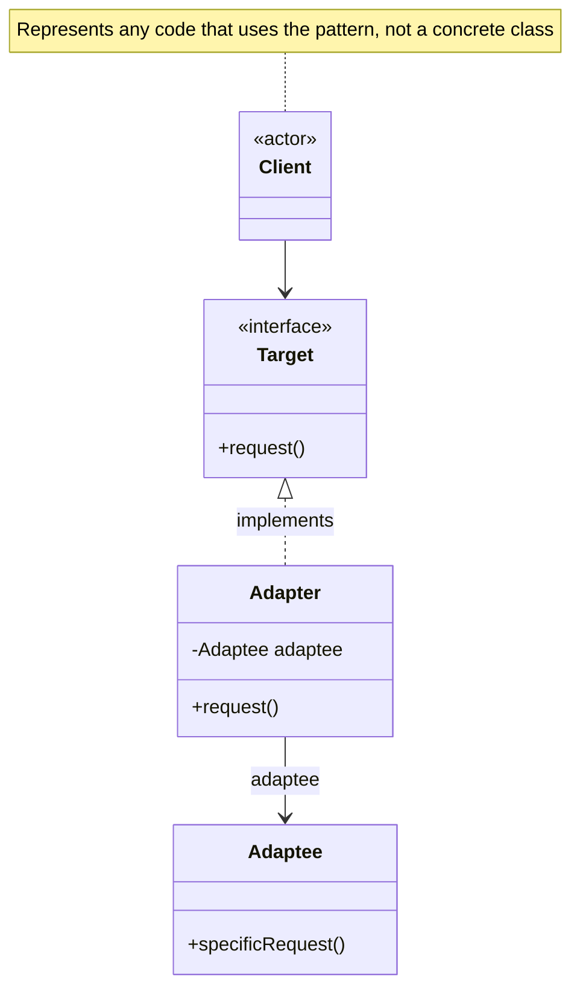
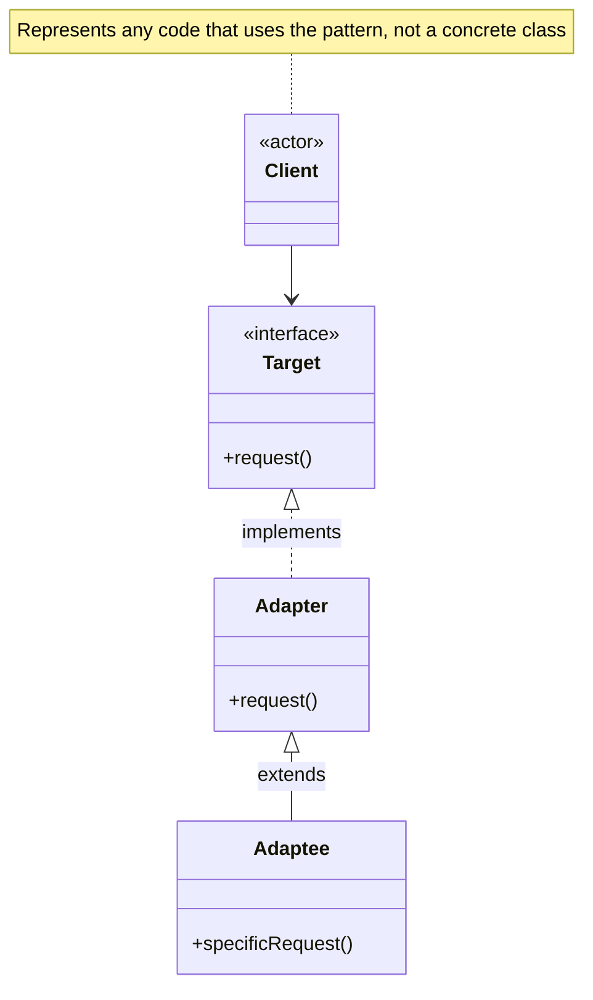

# Adapter Pattern

Convert the interface of a class into another interface clients expect. Adapter lets classes work together that couldn't otherwise because of incompatible interfaces.

## Problem

You want to use an existing class, but its interface doesn't match the one you need. Or you want to create a reusable class that cooperates with classes that don't have compatible interfaces.

**Common Scenarios:**
- Integrating third-party libraries with incompatible interfaces
- Working with legacy code that can't be modified
- Using multiple data sources with different APIs
- Adapting objects for collections that expect specific interfaces

## Design Principles Applied

1. **Program to an interface, not implementation** - Adapter implements target interface
2. **Favor composition over inheritance** - Object adapter uses composition
3. **Open/Closed Principle** - Extend without modifying existing code

## UML Diagram

### Object Adapter (using Composition)



### Class Adapter (using Inheritance)



## Implementation

### Example: Media Player

Let's adapt different media formats to work with a common media player interface.

### Step 1: Target Interface

```java
// Target interface - what client expects
public interface MediaPlayer {
    void play(String audioType, String fileName);
}
```

### Step 2: Adaptee Classes (Incompatible Interfaces)

```java
// Advanced media player interface (incompatible with MediaPlayer)
public interface AdvancedMediaPlayer {
    void playVlc(String fileName);
    void playMp4(String fileName);
}

// Concrete adaptee - VLC Player
public class VlcPlayer implements AdvancedMediaPlayer {
    @Override
    public void playVlc(String fileName) {
        System.out.println("Playing VLC file: " + fileName);
    }

    @Override
    public void playMp4(String fileName) {
        // Do nothing - VLC player doesn't support MP4
    }
}

// Concrete adaptee - MP4 Player
public class Mp4Player implements AdvancedMediaPlayer {
    @Override
    public void playVlc(String fileName) {
        // Do nothing - MP4 player doesn't support VLC
    }

    @Override
    public void playMp4(String fileName) {
        System.out.println("Playing MP4 file: " + fileName);
    }
}
```

### Step 3: Adapter Class

```java
// Adapter - adapts AdvancedMediaPlayer to MediaPlayer interface
public class MediaAdapter implements MediaPlayer {
    private AdvancedMediaPlayer advancedMusicPlayer;

    public MediaAdapter(String audioType) {
        if (audioType.equalsIgnoreCase("vlc")) {
            advancedMusicPlayer = new VlcPlayer();
        } else if (audioType.equalsIgnoreCase("mp4")) {
            advancedMusicPlayer = new Mp4Player();
        }
    }

    @Override
    public void play(String audioType, String fileName) {
        if (audioType.equalsIgnoreCase("vlc")) {
            advancedMusicPlayer.playVlc(fileName);
        } else if (audioType.equalsIgnoreCase("mp4")) {
            advancedMusicPlayer.playMp4(fileName);
        }
    }
}
```

### Step 4: Concrete Target

```java
// Concrete implementation of MediaPlayer
public class AudioPlayer implements MediaPlayer {
    private MediaAdapter mediaAdapter;

    @Override
    public void play(String audioType, String fileName) {
        // Built-in support for mp3
        if (audioType.equalsIgnoreCase("mp3")) {
            System.out.println("Playing MP3 file: " + fileName);
        }
        // Use adapter for other formats
        else if (audioType.equalsIgnoreCase("vlc") ||
                 audioType.equalsIgnoreCase("mp4")) {
            mediaAdapter = new MediaAdapter(audioType);
            mediaAdapter.play(audioType, fileName);
        } else {
            System.out.println("Invalid media type: " + audioType);
        }
    }
}
```

### Step 5: Client Code

```java
public class AdapterDemo {
    public static void main(String[] args) {
        AudioPlayer audioPlayer = new AudioPlayer();

        audioPlayer.play("mp3", "song.mp3");
        audioPlayer.play("mp4", "video.mp4");
        audioPlayer.play("vlc", "movie.vlc");
        audioPlayer.play("avi", "movie.avi");
    }
}
```

**Output:**
```
Playing MP3 file: song.mp3
Playing MP4 file: video.mp4
Playing VLC file: movie.vlc
Invalid media type: avi
```

## Real-World Examples

### Example 2: Temperature Sensor Adapter

```java
// Target interface - Celsius temperature
public interface CelsiusTemperature {
    double getTemperatureInCelsius();
}

// Adaptee - Fahrenheit sensor (legacy system)
public class FahrenheitSensor {
    public double getTemperatureInFahrenheit() {
        // Simulate reading from sensor
        return 98.6; // Normal body temperature
    }
}

// Adapter - converts Fahrenheit to Celsius
public class TemperatureAdapter implements CelsiusTemperature {
    private FahrenheitSensor fahrenheitSensor;

    public TemperatureAdapter(FahrenheitSensor sensor) {
        this.fahrenheitSensor = sensor;
    }

    @Override
    public double getTemperatureInCelsius() {
        double fahrenheit = fahrenheitSensor.getTemperatureInFahrenheit();
        return (fahrenheit - 32) * 5 / 9;
    }
}

// Client
public class TemperatureMonitor {
    private CelsiusTemperature sensor;

    public TemperatureMonitor(CelsiusTemperature sensor) {
        this.sensor = sensor;
    }

    public void displayTemperature() {
        System.out.printf("Temperature: %.1f°C%n",
            sensor.getTemperatureInCelsius());
    }

    public static void main(String[] args) {
        // Using legacy Fahrenheit sensor with Celsius monitor
        FahrenheitSensor fahrenheitSensor = new FahrenheitSensor();
        CelsiusTemperature adapter = new TemperatureAdapter(fahrenheitSensor);
        TemperatureMonitor monitor = new TemperatureMonitor(adapter);

        monitor.displayTemperature();
        // Output: Temperature: 37.0°C
    }
}
```

### Example 3: Database Adapter

```java
// Target interface
public interface DatabaseConnection {
    void connect(String connectionString);
    ResultSet executeQuery(String query);
    void disconnect();
}

// Adaptee - Legacy database API
public class LegacyDatabase {
    public void openConnection(String host, int port, String database) {
        System.out.println("Legacy connection opened: " +
            host + ":" + port + "/" + database);
    }

    public List<Map<String, Object>> runQuery(String sql) {
        System.out.println("Executing legacy query: " + sql);
        return new ArrayList<>();
    }

    public void closeConnection() {
        System.out.println("Legacy connection closed");
    }
}

// Adapter
public class DatabaseAdapter implements DatabaseConnection {
    private LegacyDatabase legacyDb;

    public DatabaseAdapter() {
        this.legacyDb = new LegacyDatabase();
    }

    @Override
    public void connect(String connectionString) {
        // Parse modern connection string: "host:port/database"
        String[] parts = connectionString.split("[:/]");
        String host = parts[0];
        int port = Integer.parseInt(parts[1]);
        String database = parts[2];

        legacyDb.openConnection(host, port, database);
    }

    @Override
    public ResultSet executeQuery(String query) {
        List<Map<String, Object>> legacyResult = legacyDb.runQuery(query);
        // Convert legacy result to ResultSet
        return convertToResultSet(legacyResult);
    }

    @Override
    public void disconnect() {
        legacyDb.closeConnection();
    }

    private ResultSet convertToResultSet(List<Map<String, Object>> data) {
        // Implementation of conversion logic
        return null; // Simplified for example
    }
}
```

## Java API Examples

### InputStreamReader

```java
// Adapts InputStream (byte stream) to Reader (character stream)
InputStream inputStream = new FileInputStream("file.txt");
Reader reader = new InputStreamReader(inputStream);

// InputStreamReader is an adapter that bridges byte streams to character streams
```

### Arrays.asList()

```java
// Adapts array to List interface
String[] array = {"a", "b", "c"};
List<String> list = Arrays.asList(array);

// Arrays.asList() adapts array to List interface
```

### Collections Framework

```java
// Enumeration to Iterator adapter
Enumeration<String> enumeration = vector.elements();
Iterator<String> iterator = Collections.list(enumeration).iterator();
```

## Object Adapter vs Class Adapter

### Object Adapter (Composition)

**Advantages:**
- More flexible - can adapt many adaptees through one adapter
- Works when adaptee is final or from third-party library
- Follows "favor composition over inheritance"

**Disadvantages:**
- Requires more code to delegate calls

```java
public class ObjectAdapter implements Target {
    private Adaptee adaptee; // Composition

    public ObjectAdapter(Adaptee adaptee) {
        this.adaptee = adaptee;
    }

    public void request() {
        adaptee.specificRequest();
    }
}
```

### Class Adapter (Inheritance)

**Advantages:**
- Less code - no need to delegate
- Can override adaptee's behavior

**Disadvantages:**
- Less flexible - can only adapt one class
- Doesn't work with final classes
- Java doesn't support multiple inheritance

```java
public class ClassAdapter extends Adaptee implements Target {
    public void request() {
        specificRequest(); // Inherited method
    }
}
```

## Two-Way Adapter

```java
// Adapter that works both ways
public class TwoWayAdapter implements Target, Adaptee {
    private Target target;
    private Adaptee adaptee;

    public TwoWayAdapter(Target target) {
        this.target = target;
    }

    public TwoWayAdapter(Adaptee adaptee) {
        this.adaptee = adaptee;
    }

    // Target interface implementation
    public void request() {
        if (adaptee != null) {
            adaptee.specificRequest();
        }
    }

    // Adaptee interface implementation
    public void specificRequest() {
        if (target != null) {
            target.request();
        }
    }
}
```

## Advantages

1. **Compatibility** - Makes incompatible interfaces work together
2. **Reusability** - Reuse existing classes with incompatible interfaces
3. **Flexibility** - Easily integrate third-party libraries
4. **Maintainability** - Changes to adaptee don't affect client
5. **Single Responsibility** - Separates interface conversion from business logic

## Disadvantages

1. **Complexity** - Adds extra layer of abstraction
2. **Performance** - Slight overhead from delegation
3. **Code Overhead** - Additional classes increase codebase size

## When to Use

✅ **Use Adapter Pattern When:**
- You want to use an existing class with incompatible interface
- You need to integrate legacy code with new systems
- You want to create reusable classes that work with unrelated classes
- You need to use several existing subclasses with missing functionality

❌ **Don't Use Adapter Pattern When:**
- You can modify the source code directly
- The interfaces are already compatible
- Creating adapter adds unnecessary complexity

## Related Patterns

- **Bridge** - Separates interface from implementation (designed upfront)
- **Decorator** - Adds responsibilities without changing interface
- **Proxy** - Provides same interface with controlled access
- **Facade** - Simplifies interface (doesn't adapt existing interface)

## Adapter vs Bridge vs Decorator

| Pattern | Intent | When Designed |
|---------|--------|---------------|
| **Adapter** | Make incompatible interfaces compatible | After systems are designed |
| **Bridge** | Separate abstraction from implementation | Before system is designed |
| **Decorator** | Add responsibilities dynamically | Either |

## Key Takeaways

1. Converts one interface to another
2. Allows incompatible classes to work together
3. Wraps existing class with new interface
4. Object adapter uses composition (preferred)
5. Class adapter uses inheritance (when possible)
6. Common in integrating legacy systems
7. Client remains unaware of adapter

---

**The Adapter Pattern makes classes work together that couldn't otherwise because of incompatible interfaces!**
