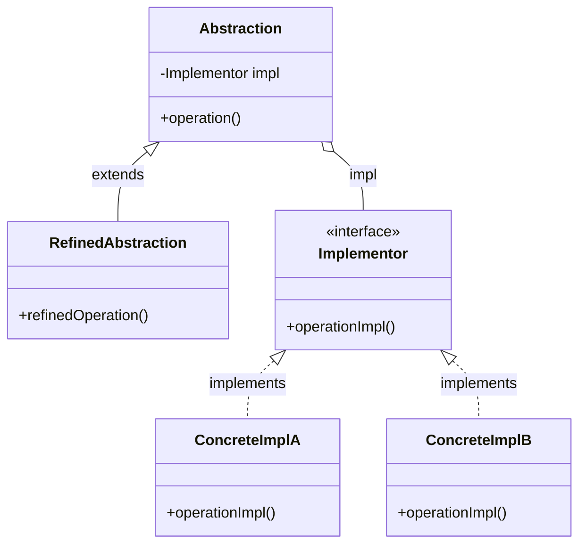

# Bridge Pattern

Decouple an abstraction from its implementation so that the two can vary independently.

## Problem

You have a class hierarchy that is growing in two independent dimensions — for example, shape types and rendering methods — and combining them through inheritance causes a class explosion.

**Common Scenarios:**
- UI components that need to support multiple platforms (Windows, macOS, Linux)
- Shapes that can be rendered in different graphics APIs
- Devices that can be controlled by different remote control types
- Database drivers that separate SQL dialect from connection handling

## Design Principles Applied

1. **Favor composition over inheritance** — implementation is held as a field, not inherited
2. **Program to an interface, not an implementation** — abstraction uses the implementor interface
3. **Encapsulate what varies** — the two dimensions (abstraction and implementation) vary independently

## UML Diagram



The abstraction holds a reference to the implementor. Subclasses of the abstraction and implementations can both vary without affecting each other.

## Implementation

### Example 1: Shape and Drawing API

Without Bridge, combining 3 shapes × 2 rendering APIs requires 6 classes. With Bridge, you need 3 + 2 = 5.

### Step 1: Implementor Interface

```java
// Implementor — defines the interface for the implementation side
public interface DrawingAPI {
    void drawCircle(double x, double y, double radius);
    void drawRectangle(double x1, double y1, double x2, double y2);
}
```

### Step 2: Concrete Implementors

```java
// Concrete Implementor A — one rendering engine
public class DrawingAPI1 implements DrawingAPI {

    @Override
    public void drawCircle(double x, double y, double radius) {
        System.out.printf("API1: Drawing circle at (%.1f, %.1f) radius %.1f%n",
            x, y, radius);
    }

    @Override
    public void drawRectangle(double x1, double y1, double x2, double y2) {
        System.out.printf("API1: Drawing rectangle (%.1f,%.1f) to (%.1f,%.1f)%n",
            x1, y1, x2, y2);
    }
}

// Concrete Implementor B — different rendering engine
public class DrawingAPI2 implements DrawingAPI {

    @Override
    public void drawCircle(double x, double y, double radius) {
        System.out.printf("API2: Circle [x=%.1f y=%.1f r=%.1f]%n",
            x, y, radius);
    }

    @Override
    public void drawRectangle(double x1, double y1, double x2, double y2) {
        System.out.printf("API2: Rect [%.1f,%.1f → %.1f,%.1f]%n",
            x1, y1, x2, y2);
    }
}
```

### Step 3: Abstraction

```java
// Abstraction — holds a reference to the Implementor
public abstract class Shape {
    protected DrawingAPI drawingAPI;

    protected Shape(DrawingAPI drawingAPI) {
        this.drawingAPI = drawingAPI;
    }

    public abstract void draw();
    public abstract void resize(double factor);
}
```

### Step 4: Refined Abstractions

```java
// Refined Abstraction — Circle
public class Circle extends Shape {
    private double x, y, radius;

    public Circle(double x, double y, double radius, DrawingAPI drawingAPI) {
        super(drawingAPI);
        this.x = x;
        this.y = y;
        this.radius = radius;
    }

    @Override
    public void draw() {
        drawingAPI.drawCircle(x, y, radius);
    }

    @Override
    public void resize(double factor) {
        radius *= factor;
    }
}

// Refined Abstraction — Rectangle
public class Rectangle extends Shape {
    private double x1, y1, x2, y2;

    public Rectangle(double x1, double y1, double x2, double y2,
                     DrawingAPI drawingAPI) {
        super(drawingAPI);
        this.x1 = x1;
        this.y1 = y1;
        this.x2 = x2;
        this.y2 = y2;
    }

    @Override
    public void draw() {
        drawingAPI.drawRectangle(x1, y1, x2, y2);
    }

    @Override
    public void resize(double factor) {
        x2 *= factor;
        y2 *= factor;
    }
}
```

### Step 5: Client Code

```java
public class BridgeDemo {
    public static void main(String[] args) {
        DrawingAPI api1 = new DrawingAPI1();
        DrawingAPI api2 = new DrawingAPI2();

        // Same Circle shape, different rendering engines
        Shape circle1 = new Circle(5, 10, 3, api1);
        Shape circle2 = new Circle(5, 10, 3, api2);

        circle1.draw(); // API1: Drawing circle at (5.0, 10.0) radius 3.0
        circle2.draw(); // API2: Circle [x=5.0 y=10.0 r=3.0]

        // Resize and redraw — shape logic is independent of rendering
        circle1.resize(2);
        circle1.draw(); // API1: Drawing circle at (5.0, 10.0) radius 6.0

        // Rectangle with API2
        Shape rect = new Rectangle(0, 0, 10, 5, api2);
        rect.draw();    // API2: Rect [0.0,0.0 → 10.0,5.0]
    }
}
```

## Example 2: Remote Control and Devices

```java
// Implementor — device interface
public interface Device {
    boolean isEnabled();
    void enable();
    void disable();
    int getVolume();
    void setVolume(int percent);
    int getChannel();
    void setChannel(int channel);
    void printStatus();
}

// Concrete Implementors
public class TV implements Device {
    private boolean on = false;
    private int volume = 30;
    private int channel = 1;

    @Override
    public boolean isEnabled() { return on; }

    @Override
    public void enable() {
        on = true;
        System.out.println("TV: powered ON");
    }

    @Override
    public void disable() {
        on = false;
        System.out.println("TV: powered OFF");
    }

    @Override
    public int getVolume() { return volume; }

    @Override
    public void setVolume(int volume) {
        this.volume = Math.max(0, Math.min(100, volume));
        System.out.println("TV: volume set to " + this.volume);
    }

    @Override
    public int getChannel() { return channel; }

    @Override
    public void setChannel(int channel) {
        this.channel = channel;
        System.out.println("TV: channel set to " + channel);
    }

    @Override
    public void printStatus() {
        System.out.printf("TV [%s] vol=%d ch=%d%n",
            on ? "ON" : "OFF", volume, channel);
    }
}

public class Radio implements Device {
    private boolean on = false;
    private int volume = 20;
    private int channel = 1;

    @Override
    public boolean isEnabled() { return on; }

    @Override
    public void enable() { on = true; System.out.println("Radio: ON"); }

    @Override
    public void disable() { on = false; System.out.println("Radio: OFF"); }

    @Override
    public int getVolume() { return volume; }

    @Override
    public void setVolume(int volume) {
        this.volume = Math.max(0, Math.min(100, volume));
    }

    @Override
    public int getChannel() { return channel; }

    @Override
    public void setChannel(int channel) { this.channel = channel; }

    @Override
    public void printStatus() {
        System.out.printf("Radio [%s] vol=%d ch=%d%n",
            on ? "ON" : "OFF", volume, channel);
    }
}

// Abstraction — remote control
public class RemoteControl {
    protected Device device;

    public RemoteControl(Device device) {
        this.device = device;
    }

    public void togglePower() {
        if (device.isEnabled()) {
            device.disable();
        } else {
            device.enable();
        }
    }

    public void volumeUp() {
        device.setVolume(device.getVolume() + 10);
    }

    public void volumeDown() {
        device.setVolume(device.getVolume() - 10);
    }

    public void channelUp() {
        device.setChannel(device.getChannel() + 1);
    }

    public void channelDown() {
        device.setChannel(device.getChannel() - 1);
    }
}

// Refined Abstraction — advanced remote with extra features
public class AdvancedRemoteControl extends RemoteControl {

    public AdvancedRemoteControl(Device device) {
        super(device);
    }

    public void mute() {
        device.setVolume(0);
        System.out.println("Remote: muted");
    }

    public void setChannel(int channel) {
        device.setChannel(channel);
    }
}

// Client
public class RemoteDemo {
    public static void main(String[] args) {
        // Basic remote with TV
        Device tv = new TV();
        RemoteControl remote = new RemoteControl(tv);
        remote.togglePower();  // TV: powered ON
        remote.volumeUp();     // TV: volume set to 40
        tv.printStatus();      // TV [ON] vol=40 ch=1

        // Advanced remote with Radio — same remote abstraction, different device
        Device radio = new Radio();
        AdvancedRemoteControl advRemote = new AdvancedRemoteControl(radio);
        advRemote.togglePower();
        advRemote.setChannel(5);
        advRemote.mute();
        radio.printStatus();
    }
}
```

## Real-World Examples

### JDBC — The Classic Java Bridge

JDBC is the most well-known Bridge implementation in Java. `Connection`, `Statement`, and `ResultSet` are the abstraction layer; each database vendor provides a `Driver` as the concrete implementor.

```java
// The abstraction (your code) stays the same regardless of database
public class UserRepository {
    private final Connection connection;  // Bridge: holds the implementor

    public UserRepository(Connection connection) {
        this.connection = connection;
    }

    public List<String> findAllUsers() throws SQLException {
        List<String> users = new ArrayList<>();
        try (Statement stmt = connection.createStatement();
             ResultSet rs = stmt.executeQuery("SELECT name FROM users")) {
            while (rs.next()) {
                users.add(rs.getString("name"));
            }
        }
        return users;
    }
}

// Swap the implementor (driver) without changing UserRepository at all
Connection mysqlConn = DriverManager.getConnection(
    "jdbc:mysql://localhost/mydb", "user", "pass");

Connection postgresConn = DriverManager.getConnection(
    "jdbc:postgresql://localhost/mydb", "user", "pass");

UserRepository mysqlRepo = new UserRepository(mysqlConn);
UserRepository postgresRepo = new UserRepository(postgresConn);
```

### SLF4J Logging

SLF4J (Simple Logging Facade for Java) is a Bridge between application code and logging frameworks (Logback, Log4j, java.util.logging).

```java
import org.slf4j.Logger;
import org.slf4j.LoggerFactory;

public class OrderService {
    // Abstraction — SLF4J Logger interface
    private static final Logger logger =
        LoggerFactory.getLogger(OrderService.class);

    public void processOrder(Order order) {
        logger.info("Processing order {}", order.getId());
        // ...
        logger.debug("Order details: {}", order);
    }
    // Switch from Logback to Log4j by swapping the dependency —
    // no changes to this class required
}
```

## Benefits

✅ **Independent variation** — abstraction and implementation can be extended without affecting each other

✅ **Avoids class explosion** — m abstractions × n implementations requires m + n classes, not m × n

✅ **Swap implementations at runtime** — set a different implementor on the abstraction at any point

✅ **Single Responsibility** — abstraction handles high-level logic; implementor handles low-level details

✅ **Open/Closed Principle** — add new abstractions or implementations without modifying existing ones

## Drawbacks

❌ **More complex upfront** — introduces extra layers and interfaces even for simple cases

❌ **Indirection overhead** — every abstraction call delegates to the implementor, adding one level of indirection

❌ **Harder to follow** — the split between abstraction and implementation can be confusing at first glance

## When to Use

✅ **Use Bridge When:**
- A class varies in two independent dimensions (e.g. type AND platform)
- You want to switch implementations at runtime
- You want to avoid a permanent binding between abstraction and implementation
- Both the abstraction and its implementation should be extensible via subclassing

❌ **Don't Use Bridge When:**
- There is only one implementation — the extra interface adds no value
- The abstraction and implementation will never vary independently — simple inheritance is clearer

## Bridge vs Adapter

These two patterns look similar but solve different problems:

| Aspect | Bridge | Adapter |
|--------|--------|---------|
| **Intent** | Decouple abstraction from implementation upfront | Make incompatible interfaces work together after the fact |
| **Design time** | Designed in from the start | Applied to existing code |
| **Structure** | Two parallel hierarchies | Wraps one interface to match another |
| **Focus** | Variation in two dimensions | Interface compatibility |

## Bridge vs Strategy

Both patterns delegate work to a separately defined interface held as a field. The difference is in scope:

| Aspect | Bridge | Strategy |
|--------|--------|---------|
| **Scope** | Structural — shapes the entire class hierarchy | Behavioral — swaps one algorithm |
| **Hierarchies** | Both sides can have subclass hierarchies | Typically one context class, many strategies |
| **Purpose** | Decouple two dimensions of variation | Make algorithms interchangeable |

## Related Patterns

- **Adapter** — also maps one interface to another, but is applied to fix existing incompatibilities rather than designed in from the start
- **Abstract Factory** — can be used to create the concrete implementors and inject them into the abstraction
- **Strategy** — similar structure (composition of an interface), but behavioral rather than structural in intent

## Key Takeaways

1. Bridge splits a class into two hierarchies: abstraction and implementation
2. The abstraction holds a reference to the implementor — it does not inherit from it
3. Both hierarchies can grow independently without affecting each other
4. JDBC and SLF4J are the most prominent Bridge examples in the Java ecosystem
5. Prefer Bridge over deep inheritance trees when two dimensions vary independently

---

**The Bridge Pattern decouples what something does (abstraction) from how it does it (implementation), letting both evolve without touching each other.**
