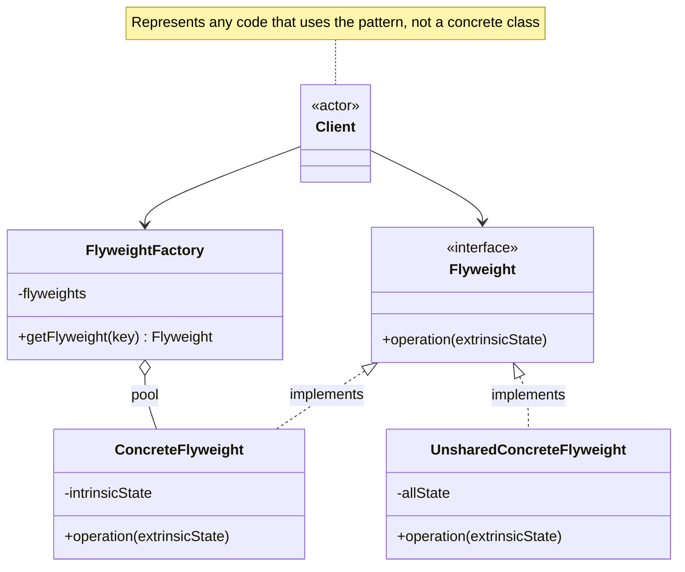

# Flyweight Pattern

Use sharing to efficiently support a large number of fine-grained objects. A flyweight is a shared object that can be used in multiple contexts simultaneously.

## Problem

You need to create a very large number of objects that share common state, and the memory cost of storing all that repeated state becomes prohibitive.

**Common Scenarios:**

- Rendering large numbers of characters in a text editor
- Particles in a game engine (bullets, sparks, leaves)
- Tree or tile objects in a map renderer
- Network connection pools
- Caching and interning of immutable objects

## Design Principles Applied

1. **Separation of Concerns** - Intrinsic (shared) state is separated from extrinsic (context-specific) state
2. **Single Responsibility** - `FlyweightFactory` manages the shared pool; `Flyweight` manages shared state
3. **Encapsulation** - Clients interact through the factory, not the pool directly

## Intrinsic vs Extrinsic State

The key to Flyweight is splitting object state into two categories:

| State | Stored in | Description |
|-------|-----------|-------------|
| **Intrinsic** | Flyweight object | Shared, immutable, context-independent |
| **Extrinsic** | Client or context | Unique per use, passed in at call time |

## UML Diagram



## Implementation

### Example: Forest Renderer

A game renders thousands of trees. Each tree has a type (shared) and a position (unique).

### Step 1: Separate Intrinsic from Extrinsic State

```java
// Intrinsic state — shared across all trees of the same type
public class TreeType {
    private final String name;
    private final String color;
    private final String texture;

    public TreeType(String name, String color, String texture) {
        this.name = name;
        this.color = color;
        this.texture = texture;
    }

    public void draw(int x, int y) {
        System.out.printf("Drawing %s tree [color=%s] at (%d, %d)%n",
            name, color, x, y);
    }
}
```

### Step 2: Create the Flyweight Factory

```java
// Factory manages the shared pool of TreeType objects
public class TreeFactory {
    private static final Map<String, TreeType> treeTypes = new HashMap<>();

    public static TreeType getTreeType(String name, String color, String texture) {
        String key = name + "_" + color;
        return treeTypes.computeIfAbsent(key,
            k -> new TreeType(name, color, texture));
    }

    public static int getPoolSize() {
        return treeTypes.size();
    }
}
```

### Step 3: Define the Context Object

```java
// Extrinsic state — unique per tree instance (position)
public class Tree {
    private final int x;
    private final int y;
    private final TreeType type; // reference to shared flyweight

    public Tree(int x, int y, TreeType type) {
        this.x = x;
        this.y = y;
        this.type = type;
    }

    public void draw() {
        type.draw(x, y);
    }
}
```

### Step 4: Client Usage

```java
public class Forest {
    private final List<Tree> trees = new ArrayList<>();

    public void plantTree(int x, int y, String name, String color, String texture) {
        TreeType type = TreeFactory.getTreeType(name, color, texture);
        trees.add(new Tree(x, y, type));
    }

    public void draw() {
        trees.forEach(Tree::draw);
    }
}

// Plant 1,000,000 trees — only 3 TreeType objects are created
Forest forest = new Forest();
for (int i = 0; i < 1_000_000; i++) {
    forest.plantTree(
        (int)(Math.random() * 2000),
        (int)(Math.random() * 2000),
        "Oak", "dark green", "oak_texture.png"
    );
}
forest.plantTree(100, 200, "Pine", "green", "pine_texture.png");
forest.plantTree(300, 400, "Birch", "white", "birch_texture.png");

System.out.println("TreeType objects in pool: " + TreeFactory.getPoolSize()); // 3
```

## Real-World Examples

- **`String.intern()`** — Java's string pool interns string literals so identical values share one object
- **`Integer.valueOf()`** — caches `Integer` objects for values -128 to 127
- **`Character` objects in text editors** — glyph objects for each character shape are shared across all uses of that character
- **Game engines** — particle systems reuse flyweight descriptors for bullet/spark appearance

## Flyweight vs Similar Patterns

| Pattern | Intent | Sharing |
|---------|--------|---------|
| **Flyweight** | Share fine-grained objects to reduce memory | Explicit pool managed by factory |
| **Singleton** | Ensure only one instance of a class | One instance only, not keyed |
| **Proxy** | Control access to another object | Wraps one object, no pool |
| **Facade** | Simplify a complex subsystem | No object sharing involved |
