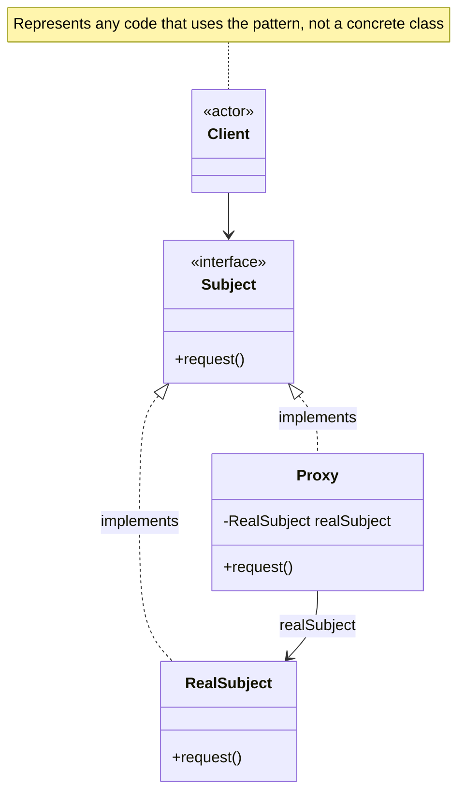

# Proxy Pattern

Provide a surrogate or placeholder for another object to control access to it.

## Problem

You need to control access to an object, add functionality when accessing an object, or delay the full cost of creation and initialization until the object is actually needed.

**Common Scenarios:**
- Virtual proxy - lazy initialization of expensive objects
- Protection proxy - access control and permissions
- Remote proxy - represent object in different address space
- Smart reference - additional actions when object is accessed

## Design Principles Applied

1. **Open/Closed Principle** - Add proxy without modifying original object
2. **Single Responsibility** - Proxy handles access control, real object handles business logic
3. **Dependency Inversion** - Both proxy and real object depend on same interface

## UML Diagram



## Types of Proxies

### 1. Virtual Proxy
Controls access to expensive objects, creates them on demand.

### 2. Protection Proxy
Controls access based on permissions.

### 3. Remote Proxy
Represents object in different address space.

### 4. Smart Reference
Performs additional actions when object is accessed.

## Implementation

### Example 1: Virtual Proxy - Image Loading

```java
// Subject interface
public interface Image {
    void display();
}

// Real Subject - Heavy object
public class RealImage implements Image {
    private String filename;

    public RealImage(String filename) {
        this.filename = filename;
        loadFromDisk();
    }

    private void loadFromDisk() {
        System.out.println("Loading image: " + filename);
        // Simulate expensive loading operation
        try {
            Thread.sleep(2000);
        } catch (InterruptedException e) {
            e.printStackTrace();
        }
    }

    @Override
    public void display() {
        System.out.println("Displaying image: " + filename);
    }
}

// Virtual Proxy - Lazy loading
public class ProxyImage implements Image {
    private RealImage realImage;
    private String filename;

    public ProxyImage(String filename) {
        this.filename = filename;
    }

    @Override
    public void display() {
        // Create real object only when needed
        if (realImage == null) {
            realImage = new RealImage(filename);
        }
        realImage.display();
    }
}

// Client
public class ProxyPatternDemo {
    public static void main(String[] args) {
        System.out.println("Creating image proxy...");
        Image image = new ProxyImage("photo.jpg");

        System.out.println("\nFirst call to display:");
        image.display(); // Loads from disk

        System.out.println("\nSecond call to display:");
        image.display(); // Uses cached object
    }
}
```

**Output:**
```
Creating image proxy...

First call to display:
Loading image: photo.jpg
Displaying image: photo.jpg

Second call to display:
Displaying image: photo.jpg
```

### Example 2: Protection Proxy - Access Control

```java
// Subject interface
public interface Document {
    void displayContent();
    void edit(String content);
    void delete();
}

// Real Subject
public class SecureDocument implements Document {
    private String content;

    public SecureDocument(String content) {
        this.content = content;
    }

    @Override
    public void displayContent() {
        System.out.println("Document content: " + content);
    }

    @Override
    public void edit(String newContent) {
        this.content = newContent;
        System.out.println("Document edited");
    }

    @Override
    public void delete() {
        content = null;
        System.out.println("Document deleted");
    }
}

// Protection Proxy
public class DocumentProxy implements Document {
    private SecureDocument document;
    private String userRole;

    public DocumentProxy(String content, String userRole) {
        this.document = new SecureDocument(content);
        this.userRole = userRole;
    }

    @Override
    public void displayContent() {
        // Everyone can view
        document.displayContent();
    }

    @Override
    public void edit(String content) {
        if ("EDITOR".equals(userRole) || "ADMIN".equals(userRole)) {
            document.edit(content);
        } else {
            System.out.println("Access denied: You don't have permission to edit");
        }
    }

    @Override
    public void delete() {
        if ("ADMIN".equals(userRole)) {
            document.delete();
        } else {
            System.out.println("Access denied: You don't have permission to delete");
        }
    }
}

// Client
public class ProtectionProxyDemo {
    public static void main(String[] args) {
        System.out.println("--- User: VIEWER ---");
        Document viewerDoc = new DocumentProxy("Secret Document", "VIEWER");
        viewerDoc.displayContent();
        viewerDoc.edit("New content");
        viewerDoc.delete();

        System.out.println("\n--- User: EDITOR ---");
        Document editorDoc = new DocumentProxy("Secret Document", "EDITOR");
        editorDoc.displayContent();
        editorDoc.edit("New content");
        editorDoc.delete();

        System.out.println("\n--- User: ADMIN ---");
        Document adminDoc = new DocumentProxy("Secret Document", "ADMIN");
        adminDoc.displayContent();
        adminDoc.edit("New content");
        adminDoc.delete();
    }
}
```

**Output:**
```
--- User: VIEWER ---
Document content: Secret Document
Access denied: You don't have permission to edit
Access denied: You don't have permission to delete

--- User: EDITOR ---
Document content: Secret Document
Document edited
Access denied: You don't have permission to delete

--- User: ADMIN ---
Document content: Secret Document
Document edited
Document deleted
```

### Example 3: Smart Reference Proxy - Reference Counting

```java
// Subject interface
public interface DatabaseConnection {
    void query(String sql);
}

// Real Subject
public class RealDatabaseConnection implements DatabaseConnection {
    public RealDatabaseConnection() {
        System.out.println("Opening database connection...");
    }

    @Override
    public void query(String sql) {
        System.out.println("Executing query: " + sql);
    }

    public void close() {
        System.out.println("Closing database connection");
    }
}

// Smart Reference Proxy
public class DatabaseConnectionProxy implements DatabaseConnection {
    private static RealDatabaseConnection realConnection;
    private static int referenceCount = 0;

    public DatabaseConnectionProxy() {
        if (realConnection == null) {
            realConnection = new RealDatabaseConnection();
        }
        referenceCount++;
        System.out.println("Reference count: " + referenceCount);
    }

    @Override
    public void query(String sql) {
        realConnection.query(sql);
    }

    public void close() {
        referenceCount--;
        System.out.println("Reference count: " + referenceCount);
        if (referenceCount == 0) {
            realConnection.close();
            realConnection = null;
        }
    }
}

// Client
public class SmartReferenceDemo {
    public static void main(String[] args) {
        DatabaseConnectionProxy conn1 = new DatabaseConnectionProxy();
        conn1.query("SELECT * FROM users");

        DatabaseConnectionProxy conn2 = new DatabaseConnectionProxy();
        conn2.query("SELECT * FROM products");

        conn1.close();
        conn2.close(); // Actually closes the connection
    }
}
```

### Example 4: Caching Proxy

```java
// Subject interface
public interface ExpensiveService {
    String fetchData(String key);
}

// Real Subject
public class RealExpensiveService implements ExpensiveService {
    @Override
    public String fetchData(String key) {
        System.out.println("Fetching data from remote server for: " + key);
        try {
            Thread.sleep(1000); // Simulate network delay
        } catch (InterruptedException e) {
            e.printStackTrace();
        }
        return "Data for " + key;
    }
}

// Caching Proxy
public class CachingProxy implements ExpensiveService {
    private RealExpensiveService realService;
    private Map<String, String> cache = new HashMap<>();

    public CachingProxy() {
        this.realService = new RealExpensiveService();
    }

    @Override
    public String fetchData(String key) {
        if (cache.containsKey(key)) {
            System.out.println("Returning cached data for: " + key);
            return cache.get(key);
        }

        String data = realService.fetchData(key);
        cache.put(key, data);
        return data;
    }

    public void clearCache() {
        cache.clear();
        System.out.println("Cache cleared");
    }
}

// Client
public class CachingProxyDemo {
    public static void main(String[] args) {
        ExpensiveService service = new CachingProxy();

        System.out.println(service.fetchData("user1")); // Fetches from server
        System.out.println(service.fetchData("user2")); // Fetches from server
        System.out.println(service.fetchData("user1")); // Returns from cache
        System.out.println(service.fetchData("user2")); // Returns from cache
    }
}
```

## Java API Examples

### Dynamic Proxy (java.lang.reflect.Proxy)

```java
// Interface
public interface UserService {
    void createUser(String name);
    void deleteUser(String name);
}

// Real implementation
public class UserServiceImpl implements UserService {
    @Override
    public void createUser(String name) {
        System.out.println("Creating user: " + name);
    }

    @Override
    public void deleteUser(String name) {
        System.out.println("Deleting user: " + name);
    }
}

// InvocationHandler
public class LoggingHandler implements InvocationHandler {
    private Object target;

    public LoggingHandler(Object target) {
        this.target = target;
    }

    @Override
    public Object invoke(Object proxy, Method method, Object[] args) throws Throwable {
        System.out.println("Before method: " + method.getName());
        Object result = method.invoke(target, args);
        System.out.println("After method: " + method.getName());
        return result;
    }
}

// Client using dynamic proxy
public class DynamicProxyDemo {
    public static void main(String[] args) {
        UserService realService = new UserServiceImpl();

        UserService proxy = (UserService) Proxy.newProxyInstance(
            UserService.class.getClassLoader(),
            new Class[] { UserService.class },
            new LoggingHandler(realService)
        );

        proxy.createUser("Alice");
        proxy.deleteUser("Bob");
    }
}
```

**Output:**
```
Before method: createUser
Creating user: Alice
After method: createUser
Before method: deleteUser
Deleting user: Bob
After method: deleteUser
```

### RMI (Remote Method Invocation)

```java
// Remote interface
public interface Calculator extends Remote {
    int add(int a, int b) throws RemoteException;
}

// Remote implementation
public class CalculatorImpl extends UnicastRemoteObject implements Calculator {
    protected CalculatorImpl() throws RemoteException {
        super();
    }

    @Override
    public int add(int a, int b) throws RemoteException {
        return a + b;
    }
}

// Client uses proxy automatically created by RMI
Calculator calc = (Calculator) Naming.lookup("rmi://localhost/Calculator");
int result = calc.add(5, 3); // Proxy forwards to remote object
```

## Proxy vs Decorator vs Adapter

| Pattern | Intent | Same Interface |
|---------|--------|----------------|
| **Proxy** | Control access | Yes |
| **Decorator** | Add responsibilities | Yes |
| **Adapter** | Convert interface | No |

## Advantages

1. **Lazy Initialization** - Create expensive objects only when needed
2. **Access Control** - Restrict access based on permissions
3. **Logging/Monitoring** - Track object usage
4. **Caching** - Cache expensive operation results
5. **Remote Communication** - Handle network communication
6. **Reference Counting** - Manage object lifecycle

## Disadvantages

1. **Added Complexity** - Extra layer of indirection
2. **Response Time** - May slow down service
3. **Duplication** - Proxy duplicates interface

## When to Use

✅ **Use Proxy Pattern When:**
- Need to control access to an object
- Want to delay object creation (lazy initialization)
- Need to add functionality when accessing object
- Want to implement access control or logging
- Need to represent remote object locally

❌ **Don't Use Proxy Pattern When:**
- Direct access is sufficient
- Performance overhead is unacceptable
- Complexity isn't justified

## Proxy Variants Summary

### Virtual Proxy
- **Purpose:** Lazy loading
- **Example:** Image loading, large object initialization
- **Benefit:** Saves memory and loading time

### Protection Proxy
- **Purpose:** Access control
- **Example:** User permissions, authentication
- **Benefit:** Security and authorization

### Remote Proxy
- **Purpose:** Remote communication
- **Example:** RMI, web services
- **Benefit:** Local representation of remote object

### Smart Reference
- **Purpose:** Additional housekeeping
- **Example:** Reference counting, logging
- **Benefit:** Automatic resource management

### Cache Proxy
- **Purpose:** Cache results
- **Example:** Database query caching
- **Benefit:** Performance improvement

## Related Patterns

- **Adapter** - Changes interface, proxy keeps same interface
- **Decorator** - Adds behavior, proxy controls access
- **Facade** - Simplifies interface, proxy controls access to single object

## Key Takeaways

1. Provides surrogate/placeholder for another object
2. Controls access to the real object
3. Proxy and real object implement same interface
4. Client doesn't know it's using a proxy
5. Multiple proxy types serve different purposes
6. Common in distributed systems (RMI, web services)
7. Useful for lazy initialization and access control

---

**The Proxy Pattern provides a surrogate or placeholder for another object to control access to it!**
